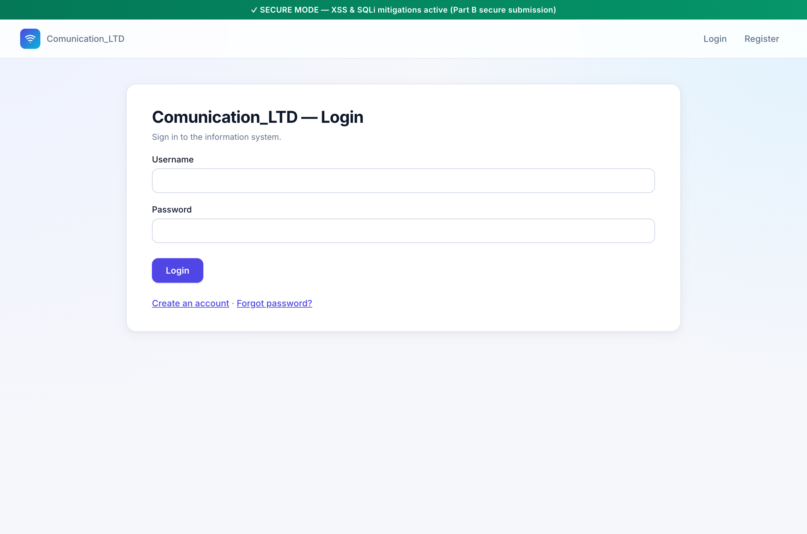
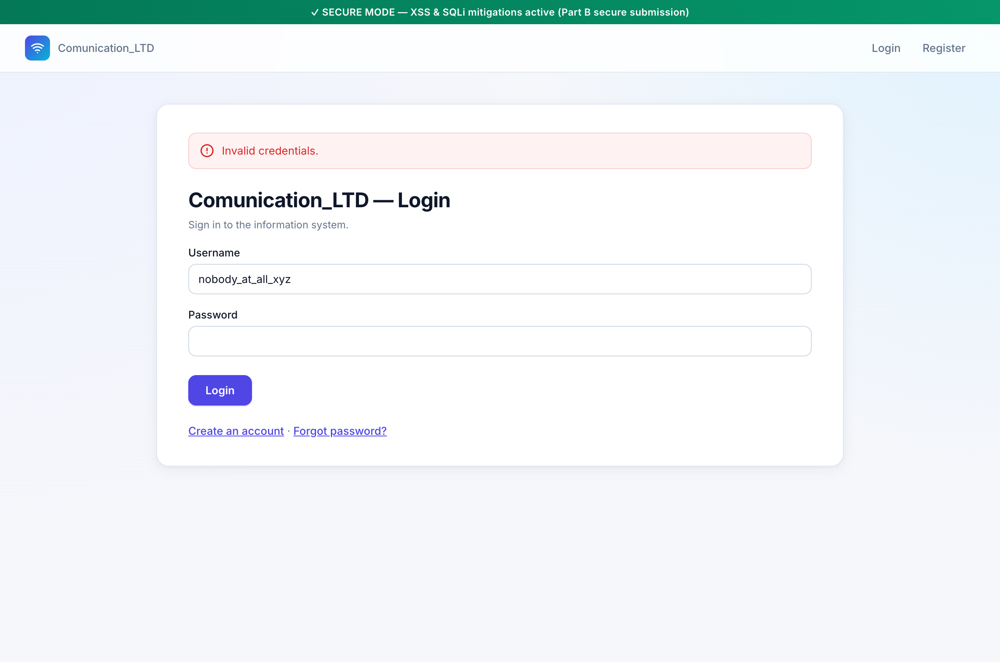
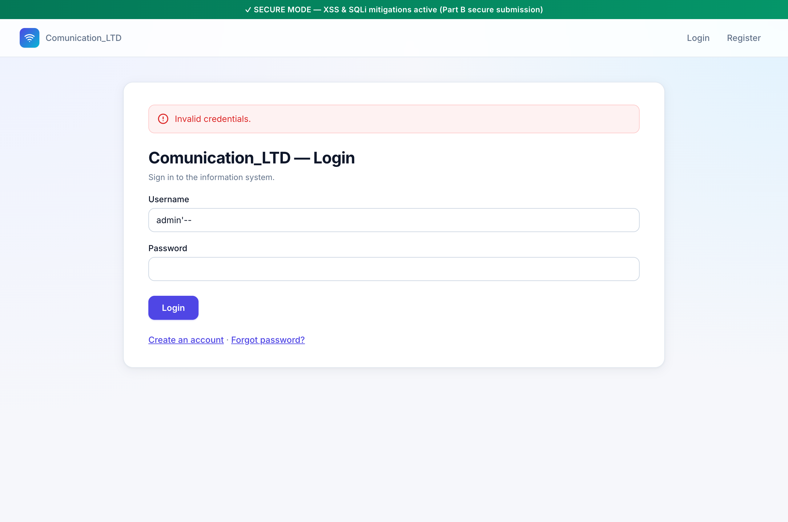
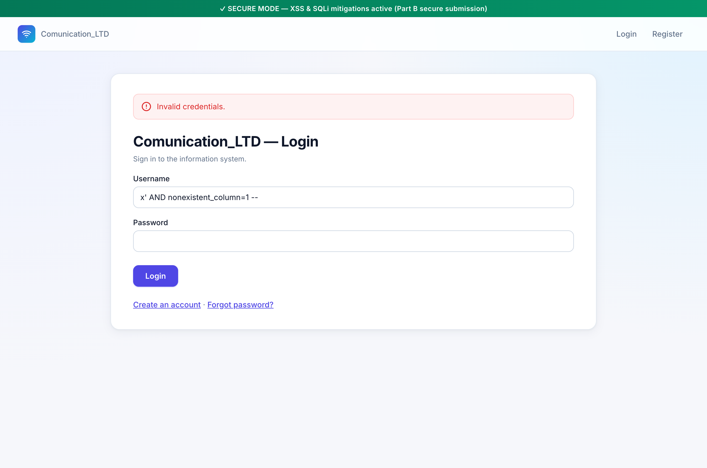

# Mitigation — Part A, Section 3 (Login) via Parameterized Queries

Live demonstration of how the **parameterized-query** mitigation defeats
the three SQL Injection attacks documented under
[Part A § 3](sqli-part-a-section-3.md). Captured against the running app
in secure mode (`VULNERABLE_MODE=0`).

---

## 1. What the spec asks for

> הצגת פתרון נגד הפרצות בסעיף 3 מחלק א על ידי שימוש ב Parameters או שימוש ב Stored procedures.

— *Demonstrate the solution against the vulnerabilities in Section 3 of
Part A using Parameters or Stored procedures.*

The vulnerabilities under attack are the three documented in
[sqli-part-a-section-3.md](sqli-part-a-section-3.md):

1. **Enumeration via comment injection** (`admin'--`) — proven by the
   error message switching from `"Invalid credentials."` to
   `"Invalid credentials. N attempt(s) remaining."` when the SQLi-found
   row caused `user.failed_login_attempts += 1` to fire.
2. **Lockout-griefing on arbitrary users** — same mechanism, weaponized
   via `' OR '1'='1' --`.
3. **Schema/syntax leak** — `x' AND nonexistent_column=1 --` reaching the
   UI as `"Database error: no such column: nonexistent_column"`.

The mitigation has to neutralize all three.

---

## 2. Parameters vs Stored Procedures — what the spec is really after

The spec offers two interchangeable options. Both achieve the same
fundamental separation: **SQL syntax** comes from the developer,
**values** come from the user, and the two are kept in different lanes.

| Approach | What the developer writes | How the engine sees user input |
|---|---|---|
| **Parameterized query** | `cursor.execute("… WHERE username = ?", [u])` | a value, bound to the `?` slot by the driver |
| **Stored procedure** | `CALL sp_find_user(?)` invoking a precompiled procedure | an argument, bound the same way |

Either form prevents the attacker's bytes from being parsed as SQL —
because *the SQL is parsed without those bytes*. Django's ORM is the
parameterized-query form: every queryset compiles to a SQL template with
`%s` placeholders plus a separate `params` tuple. The spec's "stored
procedures" route would be equivalent in safety for this case; we choose
the parameterized form because it's idiomatic Django and portable across
the engines the spec allows.

---

## 3. The fix in the codebase

[`accounts/views.py:148-154`](../../accounts/views.py#L148-L154) — the
secure branch of `login_view`:

```python
else:
    # ✅ SECURE: ORM uses parameterized queries
    try:
        user = User.objects.get(username=username)
    except User.DoesNotExist:
        user = None
```

The whole vulnerable raw-SQL block (lines 119–147) collapses into a
single ORM call. The user-controlled string `username` is passed as a
keyword argument to `.get()`. Django's queryset compiler emits a
parameterized SELECT, and the SQLite driver binds the value to a `?`
placeholder.

---

## 4. Re-running the three attacks against the mitigation

Before the test, reset the admin row's counter so the side-effect signal
is unambiguous:

```bash
$ sqlite3 db.sqlite3 \
    "UPDATE accounts_user SET failed_login_attempts=0, locked_until=NULL
       WHERE username='admin';"
$ sqlite3 db.sqlite3 \
    "SELECT username, failed_login_attempts FROM accounts_user WHERE username='admin';"
admin|0
```

### Step 0 — login screen, secure mode



### Step 1 — baseline "unknown user" signal (same as §3 baseline)

```
username = nobody_at_all_xyz
password = wrong
```



Output: `"Invalid credentials."`. Exactly as in the vulnerable build —
this is the no-user-found response shape we'll compare other attacks
against.

### Step 2 — comment injection `admin'--` (enumeration attack)

```
username = admin'--
password = wrong
```



Output: **`"Invalid credentials."`** — identical to Step 1's
unknown-user response. No counter, no "N attempts remaining" suffix.
The response shape carries no information about whether admin actually
exists.

This is the enumeration oracle being **shut**. In the vulnerable build,
the SQLi tricked `fetchone()` into returning the admin row, the view
went down the "user-was-found" branch, and the counter got rendered.
Under the mitigation the queryset compiles to:

```sql
SELECT … FROM "accounts_user" WHERE "accounts_user"."username" = %s
```

with `params = ("admin'--",)`. SQLite searches for the literal string
`admin'--` as a username; no such row exists; `DoesNotExist` is raised;
the view goes down the no-row branch. The single quote in the value is
just a single quote inside a value.

Confirm the side-effect didn't fire either:

```bash
$ sqlite3 -header -column db.sqlite3 \
    "SELECT id, username, failed_login_attempts
     FROM accounts_user WHERE username='admin';"

id  username  failed_login_attempts
--  --------  ---------------------
9   admin     0
```

Counter still 0 after the attack. In the §3 vulnerable run this number
was 1.

### Step 3 — syntax-error payload `x' AND nonexistent_column=1 --`

```
username = x' AND nonexistent_column=1 --
password = wrong
```



Output: **`"Invalid credentials."`** — no `Database error: no such
column …` anywhere.

This is the proof that SQLite never *sees* the payload as syntax. In
the vulnerable build, the string `nonexistent_column` was parsed as a
column identifier, the planner failed, and the error reached the UI.
Here the engine compiles
`WHERE "accounts_user"."username" = ?` once, then receives
`x' AND nonexistent_column=1 --` as a bound *value* to slot into the `?`
position. The SQL parser is done before the dangerous bytes ever exist
in its world.

---

## 5. Smoking gun — the parameterized SQL Django emits

Re-using the §1 technique to make the encoding explicit:

```bash
$ USE_SQLITE=1 VULNERABLE_MODE=0 python manage.py shell -c "
> from accounts.models import User
> qs = User.objects.filter(username=\"admin'--\")
> sql, params = qs.query.get_compiler('default').as_sql()
> print('SQL  :', sql)
> print('PARAM:', params)
> print('match exists?', qs.exists())
> "
```

Output:

```
SQL  : SELECT "accounts_user"."id", "accounts_user"."username", "accounts_user"."email",
       "accounts_user"."password_salt", "accounts_user"."password_hmac",
       "accounts_user"."failed_login_attempts", "accounts_user"."locked_until",
       "accounts_user"."reset_token", "accounts_user"."reset_token_expires",
       "accounts_user"."is_active", "accounts_user"."date_joined",
       "accounts_user"."last_login"
       FROM "accounts_user"
      WHERE "accounts_user"."username" = %s
PARAM: ("admin'--",)
match exists? False
```

The dangerous `'` and `--` live in the `PARAM` tuple, never in the SQL
text. `exists()` returns `False` because no row's username **is** the
literal string `admin'--`. In the vulnerable build the same payload
returned the admin row via the comment-stripping side-effect; here it
correctly returns nothing.

---

## 6. Side-by-side: vulnerable vs mitigated, all three attacks

| Payload | Vulnerable §3 response | Mitigated §3 response | What changed |
|---|---|---|---|
| `nobody_at_all_xyz` | `Invalid credentials.` (no counter) | `Invalid credentials.` (no counter) | — (baseline) |
| `admin'--` | `Invalid credentials. 2 attempt(s) remaining.` | `Invalid credentials.` | Oracle closed — same response as unknown user |
| `x' AND nonexistent_column=1 --` | `Database error: no such column: nonexistent_column` | `Invalid credentials.` | Parser never sees the payload as syntax |

Side-effects in the database:

| Run | `admin.failed_login_attempts` after the three attacks |
|---|---|
| Vulnerable §3 | 1 → 2 → 2 (the SQLi rows incremented the admin row's counter) |
| Mitigated §3 | **0** (no row was found, no counter was touched) |

The mitigation closes the information leak (no enumeration), the
griefing primitive (no arbitrary-row lockouts), and the
information-disclosure channel (no DB-error leakage) all in one move.

---

## 7. Honest caveats

1. **HMAC still gates real auth.** Even in the vulnerable build the SQLi
   didn't bypass HMAC verification — the damage was information +
   griefing, not credential takeover. The mitigation doesn't change
   that calculus; it removes the SQLi-only primitives. A weak password
   on a known username is still brute-forceable offline if the attacker
   has the salt and HMAC, which they would only acquire via a different
   attack (e.g. §4 UNION).

2. **Anti-enumeration also lives in the message layout.** A maximally
   paranoid build would also collapse "wrong password" and "no such
   user" into byte-identical responses, *including timing*. The
   parameterized-query fix here removes the response-shape oracle; a
   timing-side-channel that distinguishes "ORM raised DoesNotExist"
   from "ORM returned, HMAC compare failed" might still exist on
   contrived setups. Out of scope for the assignment, worth mentioning
   in the writeup.

3. **`@stored_procedure` would be functionally equivalent** for this
   query. We chose Django's ORM because it's the idiomatic shape; the
   spec explicitly allows either approach. The encoding work is done by
   the driver in both cases.

---

## 8. Reproduction checklist

```bash
# 1. Start in secure mode
set -a; source .env; set +a
USE_SQLITE=1 VULNERABLE_MODE=0 python manage.py runserver

# 2. Reset admin counter
sqlite3 db.sqlite3 \
  "UPDATE accounts_user SET failed_login_attempts=0, locked_until=NULL
   WHERE username='admin';"

# 3. http://127.0.0.1:8000/accounts/login/  — submit each of:
#    a. username=nobody_at_all_xyz             password=wrong  → "Invalid credentials."
#    b. username=admin'--                      password=wrong  → "Invalid credentials."   (oracle closed)
#    c. username=x' AND nonexistent_column=1 -- password=wrong → "Invalid credentials."   (no DB error)

# 4. Verify the side-effect did not fire
sqlite3 db.sqlite3 \
  "SELECT username, failed_login_attempts FROM accounts_user WHERE username='admin';"
# → admin|0    (vs 1 after the vulnerable §3 run)

# 5. Inspect the parameterized SQL Django emits
USE_SQLITE=1 VULNERABLE_MODE=0 python manage.py shell -c \
  "from accounts.models import User
qs = User.objects.filter(username=\"admin'--\")
sql, params = qs.query.get_compiler('default').as_sql()
print('SQL  :', sql)
print('PARAM:', params)"
```

---

## 9. Files referenced

| Path | Role |
|---|---|
| [`accounts/views.py:148-154`](../../accounts/views.py#L148-L154) | The secure user-lookup — Django ORM with bound parameters |
| [`accounts/views.py:119-147`](../../accounts/views.py#L119-L147) | The vulnerable branch this mitigates against (for contrast) |
| [`accounts/views.py:166-184`](../../accounts/views.py#L166-L184) | The error-message branches that *used to be* the enumeration oracle |
| [`docs/security/sqli-part-a-section-3.md`](sqli-part-a-section-3.md) | The §3 SQLi attacks this mitigation defeats |

| Screenshot | What it shows |
|---|---|
| [`screenshots/mit-s3-01-login-secure-empty.png`](screenshots/mit-s3-01-login-secure-empty.png) | Empty login form, secure-mode green banner |
| [`screenshots/mit-s3-02-baseline-unknown.png`](screenshots/mit-s3-02-baseline-unknown.png) | Unknown user → `Invalid credentials.` (baseline) |
| [`screenshots/mit-s3-03-admin-comment-no-oracle.png`](screenshots/mit-s3-03-admin-comment-no-oracle.png) | `admin'--` → same `Invalid credentials.` — oracle closed |
| [`screenshots/mit-s3-04-no-db-error.png`](screenshots/mit-s3-04-no-db-error.png) | `x' AND nonexistent_column=1 --` → no DB error, generic `Invalid credentials.` |
