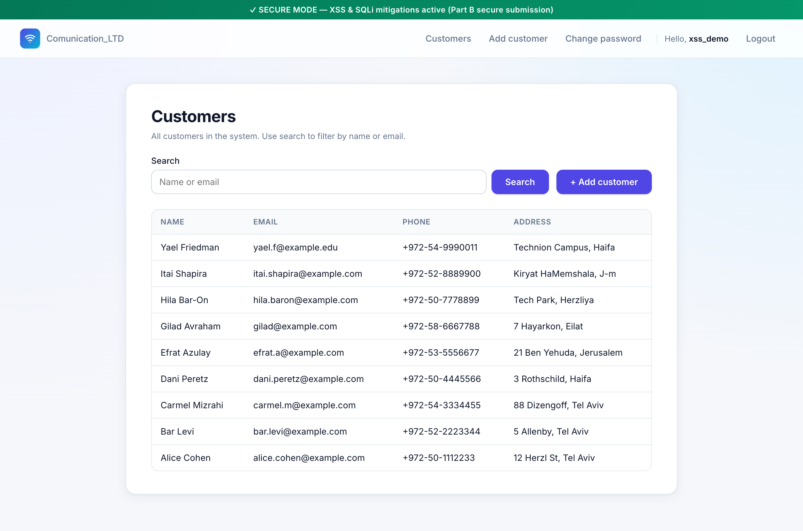
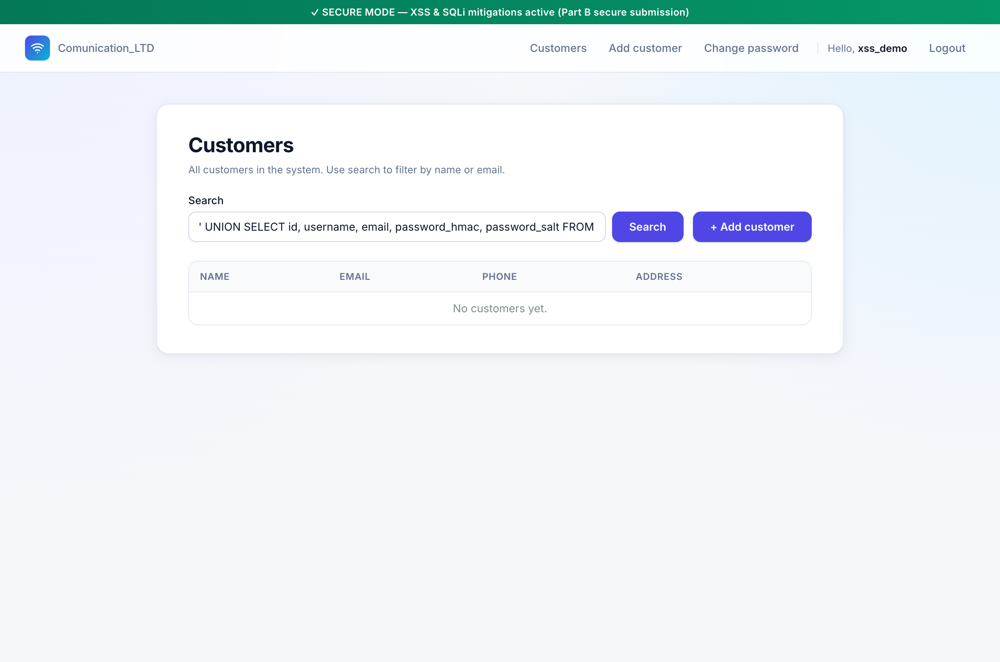
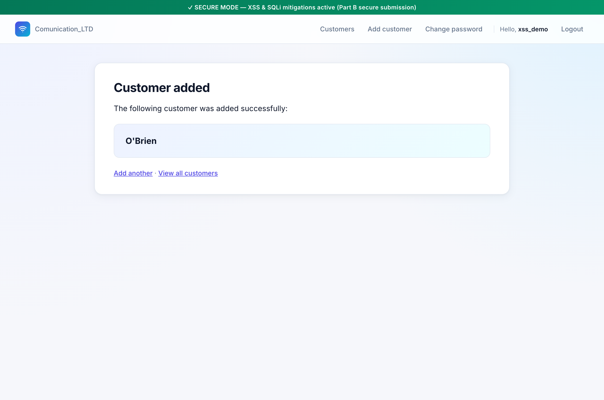
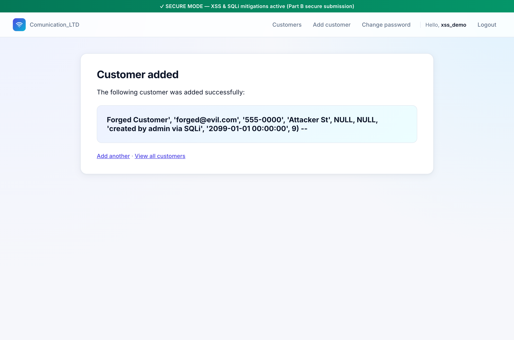
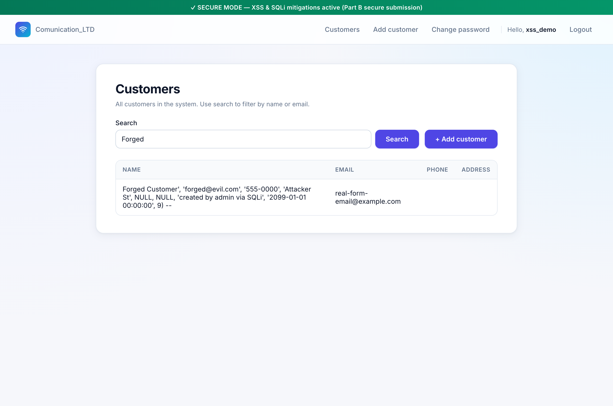

# Mitigation — Part A, Section 4 (Customer) via Parameterized Queries

Live demonstration of how the **parameterized-query** mitigation defeats
the two-sink SQL Injection vulnerability documented under
[Part A § 4](sqli-part-a-section-4.md). Captured against the running app
in secure mode (`VULNERABLE_MODE=0`), logged in as `xss_demo` (id 10).

---

## 1. What the spec asks for

> הצגת פתרון נגד הפרצות בסעיף 4 מחלק א על ידי שימוש ב Parameters או שימוש ב Stored procedures.

— *Demonstrate the solution against the vulnerabilities in Section 4 of
Part A using Parameters or Stored procedures.*

Section 4 has **two** SQL sinks documented in
[sqli-part-a-section-4.md](sqli-part-a-section-4.md):

- **Sink A — search (SELECT)**: a `' UNION SELECT id, username, email,
  password_hmac, password_salt FROM accounts_user --` payload leaked
  every user's salt + HMAC into the visible customer table.
- **Sink B — add (INSERT)**: a payload closing the VALUES list early
  let the attacker forge `created_by_id=9` (admin) while logged in as
  `xss_demo` (id 10), plus override `email`, `created_at`, and every
  other field.

The mitigation has to neutralize both sinks.

---

## 2. The fix in the codebase

[`customers/views.py:48-56`](../../customers/views.py#L48-L56) — secure
branch of `customer_list` (Sink A):

```python
else:
    # ✅ SECURE: ORM uses parameterized queries
    qs = Customer.objects.filter(full_name__icontains=query) | \
         Customer.objects.filter(email__icontains=query)
    customers = list(qs.values('id', 'full_name', 'email', 'phone', 'address'))
```

[`customers/views.py:108-119`](../../customers/views.py#L108-L119) — secure
branch of `add_customer` (Sink B):

```python
else:
    # ✅ SECURE: ORM
    Customer.objects.create(
        full_name=full_name,
        email=email,
        phone=phone,
        address=address,
        sector_id=sector_id,
        package_id=package_id,
        notes=notes,
        created_by=request.current_user,
    )
```

In both branches, every user-supplied value enters the database as a
**bound parameter**, never as a fragment of SQL text. The
session-derived `created_by` is passed as a Python object, not
concatenated as an integer literal — the ORM resolves it to a bound
value the attacker has no way to influence.

---

## 3. Re-running the attacks against the mitigation

### Step 0 — secure-mode customer list (baseline)



Nine legitimate customers; the Forged-Customer row from the §4 attack
was cleaned up before the demo so any "Forged" row showing later is
unambiguously from this run.

### Step 1 — Sink A: UNION SELECT payload as search query

Paste the §4 attack payload into the search box:

```
' UNION SELECT id, username, email, password_hmac, password_salt FROM accounts_user --
```



Result: the page renders `"No customers yet."`. The ORM treated the
payload as a literal `icontains` argument — i.e., it searched for any
customer whose `full_name` or `email` *contains the literal string*

```
' UNION SELECT id, username, email, password_hmac, password_salt FROM accounts_user --
```

— and found none. No `UNION` was ever parsed; no second SELECT was
executed; no user salts/HMACs leaked.

The parameterized SQL Django actually emitted (captured via the shell):

```sql
SELECT "customers_customer"."id", … FROM "customers_customer"
 WHERE ("customers_customer"."full_name" LIKE %s ESCAPE '\'
     OR "customers_customer"."email"     LIKE %s ESCAPE '\')
 ORDER BY "customers_customer"."created_at" DESC
```

with parameters:

```
("%' UNION SELECT id, username, email, password\_hmac, password\_salt FROM accounts\_user --%",
 "%' UNION SELECT id, username, email, password\_hmac, password\_salt FROM accounts\_user --%")
```

Two interesting details:

1. The dangerous string is the **entire value** of both `%s`
   placeholders, with `%…%` added by Django to implement
   `__icontains`. The SQL text contains no fragment of the payload.
2. The `_` characters inside `password_hmac` / `password_salt` are
   prefixed with `\` in the params — that's `icontains` *also*
   escaping the SQL LIKE wildcards (`%`, `_`) so they don't act as
   wildcards. The attacker can't inject wildcards either; their `_`
   stays a literal `_`.

This is special-character encoding by **two** mechanisms working in
the same query: parameterization (no SQL injection) **plus** LIKE
metacharacter escaping (no wildcard injection).

### Step 2 — Sink B: `O'Brien` as customer name

In the vulnerable build, the single quote in `O'Brien` produced
`Database error: near "Brien": syntax error`. Here:



The success page shows the literal name `O'Brien`. The customer was
written to the database with its name intact:

```bash
$ sqlite3 db.sqlite3 "SELECT full_name, created_by_id FROM customers_customer WHERE full_name='O''Brien';"
O'Brien|10
```

(Note SQLite's own SQL-CLI quoting rule: `''` inside a string literal
is a literal `'`.)

Real-world impact: customers can have names with apostrophes,
hyphens, even free-text in any language, and the database accepts
them without operational drama or vulnerability.

### Step 3 — Sink B: the forged-INSERT payload from §4

Paste the §4 attack's exact payload into the Full-name field:

```
Forged Customer', 'forged@evil.com', '555-0000', 'Attacker St', NULL, NULL, 'created by admin via SQLi', '2099-01-01 00:00:00', 9) -- 
```

And set the Email field to a different, **identifiable** value:

```
real-form-email@example.com
```

In the §4 attack this payload created a row attributed to admin
(`created_by_id=9`), with `email = forged@evil.com` from the payload
(the form's email was commented out by `--`).



The success page echoes the entire raw payload back as the customer
name. Now verify the actual row in the database:

```bash
$ sqlite3 -header db.sqlite3 \
    "SELECT id, substr(full_name,1,40)||'…' AS full_name_preview,
            email, phone, address, created_at, created_by_id
     FROM customers_customer WHERE full_name LIKE 'Forged Customer%';"

id  full_name_preview                          email                        phone  address  created_at                   created_by_id
17  Forged Customer', 'forged@evil.com', '55…  real-form-email@example.com                  2026-05-12 17:37:18.304223   10
```

Field-by-field diff against the §4 attack:

| Field | §4 attack (vulnerable) | §4 mitigation (secure) |
|---|---|---|
| `full_name` | `Forged Customer` (clean) | **the entire payload as one string** |
| `email` | `forged@evil.com` (payload) | **`real-form-email@example.com` (from the form)** |
| `phone` | `555-0000` (payload) | empty (form empty) |
| `address` | `Attacker St` (payload) | empty (form empty) |
| `notes` | `created by admin via SQLi` (payload) | empty (form empty) |
| `created_at` | `2099-01-01 00:00:00` (payload) | **real server time** |
| `created_by_id` | **9 = admin (forged)** | **10 = xss_demo (real)** |

Every column the attacker controlled in the vulnerable build is now
attacker-immutable. The audit trail (`created_by_id`) honestly
attributes the row to xss_demo, which is the truth.

### Step 4 — visualize the literal row in the list

Search `?q=Forged` and observe how the row looks in the UI:



This is what an attacker's payload looks like when it's correctly
treated as a value: a long, weird customer-name string sitting alone in
the Name column. Visually obvious as garbage; structurally inert.

---

## 4. Smoking gun — special-character encoding in the substituted SQL

`connection.queries` reconstructs each executed statement with the
parameter values *substituted back in*, so you can literally see the
driver's encoding work:

```bash
$ USE_SQLITE=1 VULNERABLE_MODE=0 python manage.py shell -c "
> from customers.models import Customer
> from accounts.models import User
> from django.db import connection, reset_queries
> from django.conf import settings
> settings.DEBUG = True; reset_queries()
> me = User.objects.get(username='xss_demo')
> c = Customer.objects.create(
>     full_name=\"Forged Customer', 'forged@evil.com', '555-0000', "
>               "'Attacker St', NULL, NULL, 'created by admin via SQLi', "
>               "'2099-01-01 00:00:00', 9) -- \",
>     email='inspection-only@example.com',
>     phone='', address='',
>     sector_id=None, package_id=None, notes='',
>     created_by=me,
> )
> print(connection.queries[-1]['sql'])
> c.delete()
> "
```

Output (formatted):

```sql
INSERT INTO "customers_customer"
       ("full_name", "email", "phone", "address",
        "sector_id", "package_id", "notes",
        "created_at", "created_by_id")
VALUES ('Forged Customer'',                    -- ← attacker's '   doubled to ''
        ''forged@evil.com'',                   -- ← every payload  '   doubled
        ''555-0000'',
        ''Attacker St'',
        NULL, NULL,
        ''created by admin via SQLi'',
        ''2099-01-01 00:00:00'',
        9) -- ',                               -- ← driver's real  ' closes the string
       'inspection-only@example.com',          -- ← email from the form
       '', '', NULL, NULL, '',
       '2026-05-12 17:38:38.…',                -- ← real server timestamp
       10)                                     -- ← real xss_demo id, NOT 9
       RETURNING "customers_customer"."id"
```

Watch what happened to every `'` character in the attacker's payload:
the SQLite driver **doubled** it (`'` → `''`). That's the SQL
standard's literal-quote-escape rule. Inside a `'…'` string literal,
`''` is read as a single embedded apostrophe, **not** as a
string-literal terminator.

So the surrounding `'…'` that wraps the entire payload never closes
early. The whole thing — `Forged Customer', 'forged@evil.com', …, 9)
-- ` — lives as the *value* of the `full_name` column. There is no
extra VALUES tuple; there is no comment to strip later fields; there
is no second statement. The `--` at the end is just two minus signs
inside a string.

Meanwhile the driver inserted the *real* `email`, `created_at`, and
`created_by_id` from the values the application code passed — the
ones the application owns authoritatively.

---

## 5. Side-by-side: vulnerable vs mitigated

| Sink | Payload | Vulnerable §4 outcome | Mitigated §4 outcome |
|---|---|---|---|
| Search | `' UNION SELECT id, username, email, password_hmac, password_salt FROM accounts_user --` | Admin / xss_demo / forgetful HMACs & salts appear in customer table | `No customers yet.` — payload treated as a literal `LIKE` substring |
| Add | `O'Brien` | `Database error: near "Brien": syntax error` | Row stored cleanly; name is `O'Brien` |
| Add | `Forged Customer', …, 9) -- ` payload | Row inserted with attacker-controlled `created_by_id=9`, payload's email, `2099` timestamp | Row inserted with `full_name = entire payload as one string`; `created_by_id=10`, form's email, real timestamp |

In every case the mitigation collapses the attack into "store the user's
weird string as a string" — which is what an information system **should**
do for arbitrary user input.

---

## 6. Honest caveats

1. **Stored procedures would be functionally equivalent.** The spec
   offers both. Django's ORM uses parameterized queries; a stored-proc
   variant (`CALL sp_add_customer(?, ?, …, ?);`) would route through
   the same parameter-binding layer at the driver level. Same
   guarantees, more setup.

2. **Mitigation removes SQLi only.** The attacker's payload IS still
   sitting in the customer table — as data. If your application later
   renders it `|safe` you'd be back to the §4 Stored XSS demo. The
   parameterized-INSERT defense is independent of the auto-escape
   defense on the output side; both must hold.

3. **Wildcard injection is also blocked.** Django's `__icontains`
   escapes LIKE metacharacters (`%`, `_`) in the user value. A
   different ORM API that builds a `LIKE` query without that escape
   would still be safe from SQL injection but vulnerable to wildcard
   abuse (e.g. `_` matches one character → attacker enumerates by
   character). Not relevant here, but worth knowing.

4. **`request.current_user.id` is no longer attacker-controllable.**
   Even if the attacker stuffs `9` into the form, the ORM passes the
   `created_by=request.current_user` object — a session-derived value
   — as a separate bound parameter. The attacker can no longer
   smuggle a different ID through any text field.

---

## 7. Reproduction checklist

```bash
# 1. Start in secure mode
set -a; source .env; set +a
USE_SQLITE=1 VULNERABLE_MODE=0 python manage.py runserver

# 2. Login (e.g. xss_demo / Demo!Passw0rd#2026)

# Sink A — search
# 3. /customers/  →  search:
#    ' UNION SELECT id, username, email, password_hmac, password_salt FROM accounts_user --
#    → "No customers yet." (no leak)

# Sink B — add (normal name with apostrophe)
# 4. /customers/add/  →  Full name = O'Brien
#    → row inserted, no DB error

# Sink B — add (forged-INSERT payload from §4)
# 5. /customers/add/  →  Full name = Forged Customer', …, 9) --
#    Email = real-form-email@example.com
#    → row stored with full_name = entire payload; created_by_id correctly = your id

# 6. Verify
sqlite3 -header db.sqlite3 \
  "SELECT id, substr(full_name,1,40)||'…', email, created_at, created_by_id
   FROM customers_customer WHERE full_name LIKE 'Forged Customer%';"
# → created_by_id is your real id, NOT 9 (admin); email is real-form-email@example.com, NOT forged@evil.com

# 7. (Optional) Inspect the substituted SQL with the double-quote escapes
USE_SQLITE=1 VULNERABLE_MODE=0 python manage.py shell -c \
  "from customers.models import Customer
from accounts.models import User
from django.db import connection, reset_queries
from django.conf import settings
settings.DEBUG=True; reset_queries()
me = User.objects.get(username='xss_demo')
c = Customer.objects.create(full_name=\"O'Brien\", email='x@example.com',
                            phone='', address='', notes='', created_by=me)
print(connection.queries[-1]['sql'])
c.delete()"
```

---

## 8. Files referenced

| Path | Role |
|---|---|
| [`customers/views.py:48-56`](../../customers/views.py#L48-L56) | Secure search — ORM with `__icontains` (parameterized + LIKE-wildcard-escaped) |
| [`customers/views.py:108-119`](../../customers/views.py#L108-L119) | Secure add — `Customer.objects.create(...)` |
| [`customers/views.py:28-47`](../../customers/views.py#L28-L47) | The vulnerable SELECT we're protecting against (for contrast) |
| [`customers/views.py:84-103`](../../customers/views.py#L84-L103) | The vulnerable INSERT we're protecting against (for contrast) |
| [`docs/security/sqli-part-a-section-4.md`](sqli-part-a-section-4.md) | The §4 SQLi attacks this mitigation defeats |

| Screenshot | What it shows |
|---|---|
| [`screenshots/mit-s4-01-customer-list-secure-baseline.png`](screenshots/mit-s4-01-customer-list-secure-baseline.png) | Customer list in secure mode — 9 legitimate rows |
| [`screenshots/mit-s4-02-search-union-neutralized.png`](screenshots/mit-s4-02-search-union-neutralized.png) | UNION payload → `No customers yet.` (no leak) |
| [`screenshots/mit-s4-03-obrien-added-cleanly.png`](screenshots/mit-s4-03-obrien-added-cleanly.png) | `O'Brien` accepted — no DB error |
| [`screenshots/mit-s4-04-forged-insert-stored-as-literal.png`](screenshots/mit-s4-04-forged-insert-stored-as-literal.png) | Forged-INSERT payload stored as a single literal customer name |
| [`screenshots/mit-s4-05-list-shows-payload-as-name.png`](screenshots/mit-s4-05-list-shows-payload-as-name.png) | Customer list shows the entire payload as one row's name — structurally inert |
