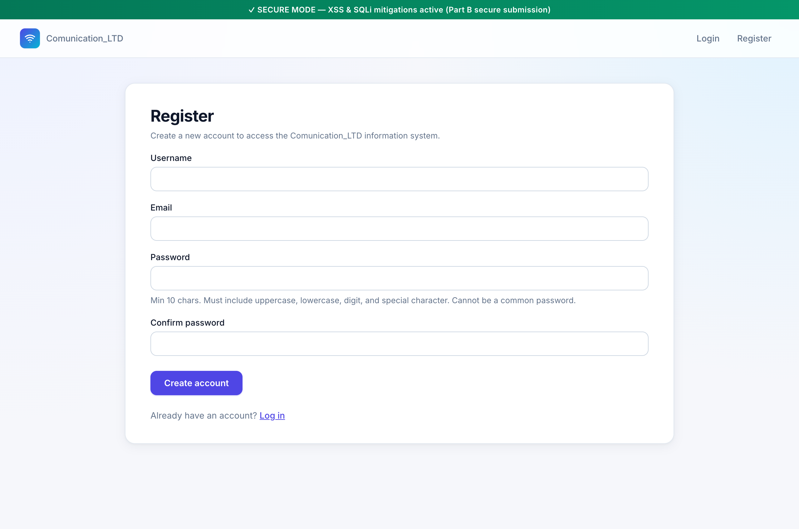
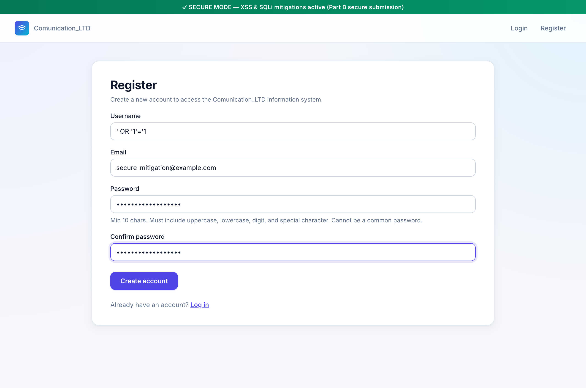
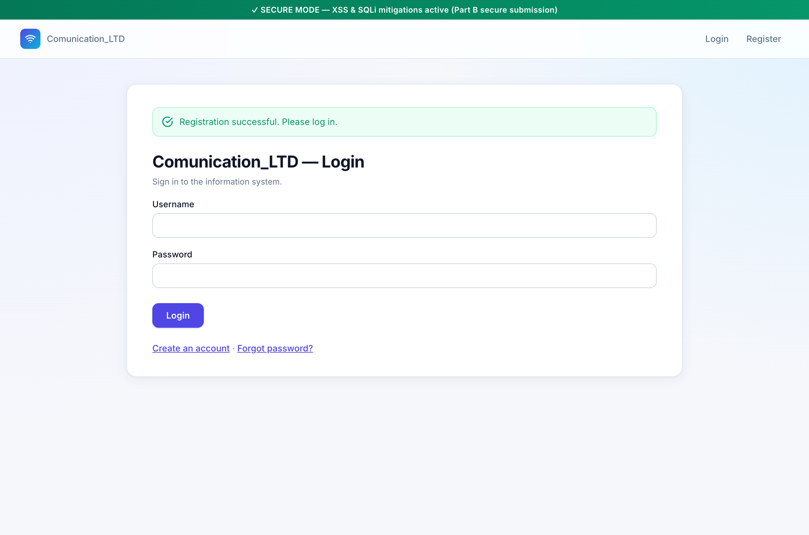

# Mitigation — Part A, Section 1 (Register) via Special-Character Encoding

Live demonstration of how the **special-character encoding** mitigation
neutralizes the SQL Injection vulnerability documented under
[Part A § 1](sqli-part-a-section-1.md). Captured against the running app
in secure mode (`VULNERABLE_MODE=0`).

---

## 1. What the spec asks for

> הצגת פתרון נגד הפרצות בסעיף 1 על ידי שימוש בקידוד של תווים מיוחדים.

— *Demonstrate the solution against the vulnerabilities in Section 1 using
special-character encoding.*

The vulnerability under attack is the username-uniqueness SQL injection
documented separately in
[sqli-part-a-section-1.md](sqli-part-a-section-1.md). Same screen, same
payload — the mitigation has to make the attack stop working.

---

## 2. What "special-character encoding" means here

A SQLi-style attack works because the attacker's bytes are parsed as SQL
**syntax** — the single quote in `' OR '1'='1` terminates a string literal
and lets the rest of the bytes act as SQL code. The encoding mitigation
**removes the syntactic meaning of those bytes** before they reach the
parser.

There are two ways to encode:

1. **Manual** — escape the dangerous characters in code before
   concatenation:
   ```python
   escaped = username.replace("'", "''")        # SQL's literal-escape rule
   sql = f"... WHERE username = '{escaped}'"
   ```
   With this, the attacker's `'` becomes the two characters `''`, which
   SQLite reads as "one embedded quote inside a string literal", not as a
   string-literal terminator. The attack is defused — but the developer
   bears the burden of remembering to call `replace` at every sink, and
   the manual list of dangerous characters is database-specific (Postgres
   has `\` escape conventions in some modes, SQL Server uses `'`, NUL
   bytes are special on some drivers, …).

2. **Parameterized queries** — let the database driver do the encoding,
   guaranteed and per-engine:
   ```python
   cursor.execute("... WHERE username = ?", [username])
   ```
   The `?` is a **placeholder**. The string `username` is sent down a
   *separate channel* from the SQL text, the driver applies the engine's
   exact encoding rules, and the SQL parser never sees the dangerous
   bytes as syntax. It can't forget; it can't get the engine-specific
   rules wrong.

Django's ORM is the second form. Every queryset compiles to a SQL string
full of `%s` placeholders plus a `params` tuple — the developer never
writes the encoding code, the driver always runs it.

That's the mechanism the spec calls **special-character encoding**: in
the parameterized world the encoding is implicit and invariant, but it
is still happening — bytes that would have been SQL operators are
delivered as ordinary string content.

---

## 3. The fix in the codebase

[`accounts/views.py:76-81`](../../accounts/views.py#L76-L81) — the secure
branch of `register_view`:

```python
else:
    # ✅ SECURE: parameterized query (Stored Procedure equivalent via ORM)
    if User.objects.filter(username=username).exists():
        errors.append("Username already exists.")
    if User.objects.filter(email=email).exists():
        errors.append("Email already exists.")
```

Compare with the vulnerable branch (file:lines 64–75) which builds an
`f"… WHERE username = '{username}' …"` by concatenation. Two characters
of difference in the source, an infinite difference in security.

---

## 4. Re-running the attack against the mitigation

### Step 1 — secure-mode register form



The green banner confirms `VULNERABLE_MODE=0`. UI is otherwise identical
to the vulnerable build — the only difference lives in the view code.

### Step 2 — same SQLi payload as the §1 attack

```
username = ' OR '1'='1
email    = secure-mitigation@example.com
password = Demo!Passw0rd#2026
```



This is the identical byte sequence that produced "Username or email
already exists." in the vulnerable build. The expectation now: no SQLi.

### Step 3 — submission succeeds; the attacker payload is stored as data



The page says **"Registration successful. Please log in."** No false
positive, no error. The uniqueness check ran, returned "no such user",
the row was inserted, and the attacker now has an account whose
username is the literal string `' OR '1'='1`.

Verify in SQL:

```bash
$ sqlite3 -header -column db.sqlite3 \
    "SELECT id, username, email FROM accounts_user
     WHERE email='secure-mitigation@example.com';"

id  username     email
--  -----------  -----------------------------
12  ' OR '1'='1  secure-mitigation@example.com
```

The dangerous characters survived the round-trip intact — because at no
point along that round-trip were they ever treated as SQL syntax.

---

## 5. Smoking gun — the parameterized SQL Django actually emitted

This is the crucial piece for the write-up. Drop into the Django shell
and ask the ORM what it sends to the database for the same query:

```bash
$ USE_SQLITE=1 VULNERABLE_MODE=0 python manage.py shell -c "
> from accounts.models import User
> qs = User.objects.filter(username=\"' OR '1'='1\")
> sql, params = qs.query.get_compiler('default').as_sql()
> print('SQL  :', sql)
> print('PARAM:', params)
> "
```

Output:

```
SQL  : SELECT … FROM "accounts_user" WHERE "accounts_user"."username" = %s
PARAM: ("' OR '1'='1",)
```

Three things to notice:

1. The SQL text contains a `%s` **placeholder** (which Django translates
   to SQLite's `?` at the driver layer) instead of an inline value.
2. The dangerous string `' OR '1'='1` lives in the *parameters tuple*,
   sent down a separate channel to the driver. It never enters the SQL
   text.
3. There is no `' OR '` substring anywhere in the SQL — there is no SQL
   for it to inject *into*. The tautology that broke the vulnerable
   build (`'1'='1'`) can't form because the surrounding quotes around
   the value were never there to break out of.

That's special-character encoding by **construction**, not by
remembering to escape. The dangerous characters' syntactic meaning is
removed not because each `'` was rewritten to `''`, but because the
parser was never asked to look at them at all.

---

## 6. Reproduction checklist

```bash
# 1. Start in secure mode
set -a; source .env; set +a
USE_SQLITE=1 VULNERABLE_MODE=0 python manage.py runserver

# 2. http://127.0.0.1:8000/accounts/register/
#    Username:           ' OR '1'='1                 (same payload as §1 attack)
#    Email:              secure-mitigation@example.com
#    Password / Confirm: Demo!Passw0rd#2026
# 3. Submit → "Registration successful. Please log in."   (no SQLi)

# 4. Verify the row was stored with the literal payload as a username
sqlite3 -header -column db.sqlite3 \
  "SELECT id, username, email FROM accounts_user
   WHERE email='secure-mitigation@example.com';"

# 5. Inspect the actual parameterized SQL Django emits
USE_SQLITE=1 VULNERABLE_MODE=0 python manage.py shell -c \
  "from accounts.models import User
qs = User.objects.filter(username=\"' OR '1'='1\")
sql, params = qs.query.get_compiler('default').as_sql()
print('SQL  :', sql)
print('PARAM:', params)"
```

---

## 7. Why parameterized queries beat manual escape

Both approaches qualify as "special-character encoding" — but parameter
binding is the strictly better form.

| | Manual escape (`replace("'", "''")`) | Parameterized (`?` placeholder) |
|---|---|---|
| **Catches `'`?** | ✓ | ✓ (handled by driver) |
| **Catches NUL bytes / encoding tricks?** | depends on the engine — easy to miss | ✓ — driver knows the rules |
| **Engine-portable?** | ✗ — each engine has different rules | ✓ — same code on SQLite, Postgres, MySQL |
| **Forgettable?** | every sink needs the call | ✗ — the API has no other shape |
| **Composable with `LIKE`, `IN (…)`, etc.?** | error-prone | natural |
| **Read by humans?** | obvious encoding intent, but noisy | placeholders read as templates |

Bottom line: when the spec asks for "special-character encoding", use
the parameterized form unless there's a compelling reason not to —
which there essentially never is for application code.

---

## 8. Honest caveats

1. **The mitigation only fixes SQLi**, not policy violations. If the
   attacker tried to register the same `' OR '1'='1` username twice,
   the secure-mode uniqueness check would *correctly* report "already
   exists" the second time — because user 12 above has that literal
   username. That's correct behavior, not a leak.

2. **Django's `models.QuerySet` doesn't expose Stored Procedures**, but
   the spec treats parameterized queries and stored procedures as
   interchangeable mitigations for this category. They are, for the
   purposes of escaping user input from SQL syntax. A stored procedure
   accepts arguments that the engine treats as values; a parameterized
   `cursor.execute("…?", [v])` does the same. The mechanism in this
   codebase is the second form.

3. **The vulnerable branch is still present** in the codebase, gated by
   `VULNERABLE_MODE`. That's intentional — the assignment requires both
   builds. The point of the secure build is that, when graders run it,
   the same payloads from the attack writeup fail to escalate beyond
   what a value should be allowed to do.

---

## 9. Files referenced

| Path | Role |
|---|---|
| [`accounts/views.py:76-81`](../../accounts/views.py#L76-L81) | The secure uniqueness check — Django ORM with bound parameters |
| [`accounts/views.py:64-75`](../../accounts/views.py#L64-L75) | The vulnerable branch we're protecting against (for contrast) |
| [`accounts/models.py:22`](../../accounts/models.py#L22) | `User.username` — the column whose uniqueness is parameterized |
| [`docs/security/sqli-part-a-section-1.md`](sqli-part-a-section-1.md) | The §1 SQLi attack this mitigation defeats |

| Screenshot | What it shows |
|---|---|
| [`screenshots/mit-s1-01-register-secure-empty.png`](screenshots/mit-s1-01-register-secure-empty.png) | Empty register form, secure-mode green banner |
| [`screenshots/mit-s1-02-register-secure-payload-filled.png`](screenshots/mit-s1-02-register-secure-payload-filled.png) | Same payload as the §1 SQLi attack, filled in |
| [`screenshots/mit-s1-03-register-secure-success.png`](screenshots/mit-s1-03-register-secure-success.png) | "Registration successful." — payload was stored as a value, not executed as SQL |
