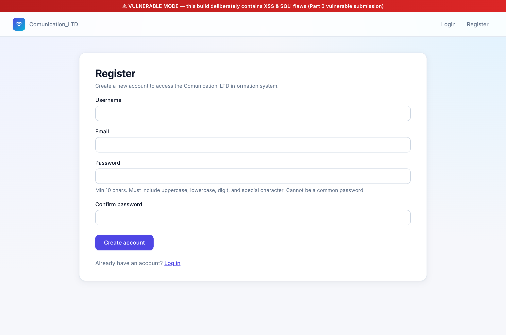
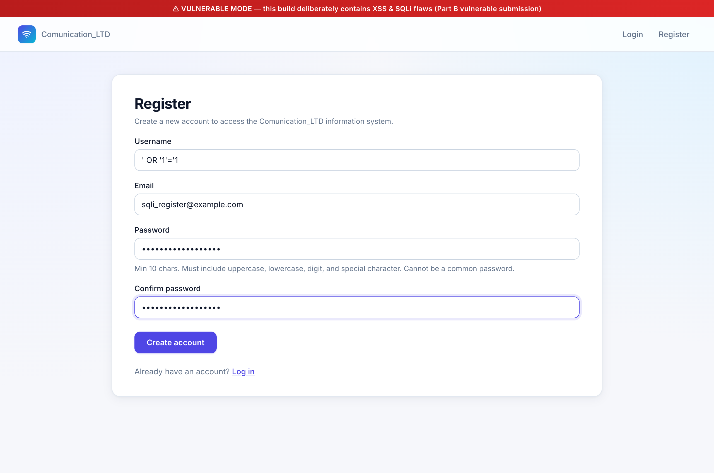
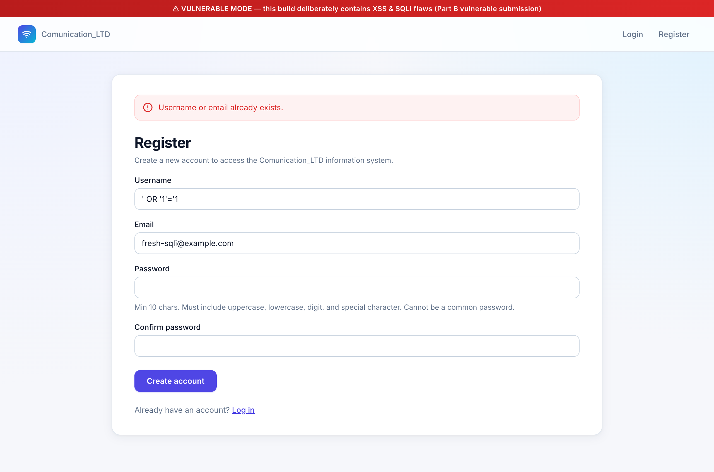

# SQL Injection — Part A, Section 1 (מסך Register)

Live demonstration of a **SQL Injection** vulnerability in the Register
screen of `Communication_LTD`, captured end-to-end via Chrome DevTools
against the running app in vulnerable mode (`VULNERABLE_MODE=1`).

This document covers the **attack** half of the requirement. The mitigation
(parameterized queries) is treated separately under the spec's
"Parameters / Stored procedures" item.

---

## 1. What the spec asks for

Part A, section 1 (מסך Register של משתמשים חדשים):

> הגדרת יוזרים חדשים — הגדרת סיסמא מורכבת — סיסמא תשמר במסד הנתונים באמצעות
> שימוש בפונקציית HMAC + Salt — הגדרת מייל למשתמש.

The Part B counterpart asks us to demonstrate a SQLi against this same screen:

> הצגת דוגמא לשימוש בהתקפה מסוג SQLi על סעיף 1 מחלק א של הפרויקט.

---

## 2. The vulnerability

The username-uniqueness check inside [`register_view`](../../accounts/views.py)
is built by **string concatenation** when `VULNERABLE_MODE` is on. The user
input goes straight into the SQL text — no escaping, no binding — so an
attacker who supplies a value containing a single quote terminates the SQL
string literal and gets to inject arbitrary SQL fragments.

[`accounts/views.py:59-75`](../../accounts/views.py#L59-L75):

```python
if settings.VULNERABLE_MODE:
    with connection.cursor() as cursor:
        sql = (
            "SELECT id, username FROM accounts_user "
            f"WHERE username = '{username}' OR email = '{email}'"
        )
        cursor.execute(sql)
        row = cursor.fetchone()
        if row:
            errors.append("Username or email already exists.")
```

Critical detail: the only signal the view exposes back to the user is whether
`fetchone()` returned **any** row. So a payload whose only goal is to make the
WHERE clause **truthy** is enough to leak information — the app will respond
"Username or email already exists" the instant the SQLi succeeds.

---

## 3. The attack

### Payload

```
username = ' OR '1'='1
email    = fresh-sqli@example.com
password = Demo!Passw0rd#2026   (any policy-compliant password)
```

The single-quote in the username field closes the string literal in the
attacker's favor. The reconstructed SQL the server actually runs is:

```sql
SELECT id, username FROM accounts_user
 WHERE username = '' OR '1'='1' OR email = 'fresh-sqli@example.com'
```

Operator precedence makes `'1'='1'` a free-standing always-true predicate.
The whole WHERE clause becomes `false OR true OR …` → true →
the query returns the **first row of `accounts_user`** regardless of what
that row's username or email actually is.

### Step 1 — open the Register screen (vulnerable build)



The red banner at the top confirms `VULNERABLE_MODE=1`. The screen is the
ordinary Section-1 Register form (username / email / password / confirm) —
nothing about the UI hints that it's exploitable.

### Step 2 — submit the SQLi payload



The Username field carries the payload `' OR '1'='1`. All other fields
hold legitimate, policy-compliant values — so the server cannot reject the
submission on validation grounds before reaching the SQL check.

### Step 3 — the server thinks the username "already exists"



The view reports the username (or email) already exists — yet **no row in
the database literally matches** either the typed username `' OR '1'='1`
or the typed email `fresh-sqli@example.com`. We can confirm this directly
against SQLite:

```bash
$ sqlite3 db.sqlite3 \
    "SELECT COUNT(*) FROM accounts_user
     WHERE username = ''' OR ''1''=''1'
        OR email = 'fresh-sqli@example.com';"
0
```

Zero literal matches — but the app reports a match. The only way that
happens is if the SQL the server actually ran was different from the SQL
the code "thinks" it ran. That delta is the SQL injection.

---

## 4. Why this is dangerous

The false-positive looks mild — it's "just" a wrong error message. But the
same primitive is the building block for serious attacks:

- **User enumeration.** Try `' OR username='admin'--` — the page only reports
  "exists" if a row with that username exists. The attacker walks the user
  table one guess at a time.
- **Account griefing.** The check runs *before* registration; the attacker
  doesn't need credentials to abuse it. They can probe at will.
- **Lateral SQL.** Any payload that the SQLite parser accepts will execute.
  A `UNION SELECT` could pull data from arbitrary tables; on a backend
  database that allows stacked statements (MySQL with `multi_statements`,
  some Postgres setups), the attacker can run `INSERT`, `UPDATE`, even DDL.
- **Authentication bypass downstream.** Section 3 (Login) has the same
  string-concat pattern — proven separately. There, the attacker doesn't
  just enumerate users, they can dump password salt/HMAC pairs via UNION
  selects on a column-compatible projection.

The root cause is identical in every case: user input concatenated into SQL
text. The fix — covered separately — is to never do that. Use bound
parameters (`?` placeholders or Django ORM kwargs) and SQL syntax becomes
immune to whatever bytes the user supplies.

---

## 5. Reproduction checklist

```bash
# 1. Start the vulnerable build
set -a; source .env; set +a
USE_SQLITE=1 VULNERABLE_MODE=1 python manage.py runserver

# 2. Browse to http://127.0.0.1:8000/accounts/register/
#    Username:           ' OR '1'='1
#    Email:              fresh-sqli@example.com   (anything that isn't already used)
#    Password / Confirm: any policy-compliant value
# 3. Submit → "Username or email already exists." appears
# 4. Verify with SQL that no row literally matches the input
```

---

## 6. Files referenced

| Path | Role |
|---|---|
| [`accounts/views.py:59-75`](../../accounts/views.py#L59-L75) | `register_view` — vulnerable uniqueness check |
| [`accounts/templates/accounts/register.html`](../../accounts/templates/accounts/register.html) | The form that feeds the payload to the view |
| [`communication_ltd/settings.py`](../../communication_ltd/settings.py) | `VULNERABLE_MODE` toggle |

| Screenshot | What it shows |
|---|---|
| [`screenshots/sqli-s1-01-register-empty.png`](screenshots/sqli-s1-01-register-empty.png) | Empty register form, vulnerable mode banner |
| [`screenshots/sqli-s1-02-register-payload-filled.png`](screenshots/sqli-s1-02-register-payload-filled.png) | Form filled with the `' OR '1'='1` payload |
| [`screenshots/sqli-s1-03-register-false-positive.png`](screenshots/sqli-s1-03-register-false-positive.png) | App reports "already exists" though no row matches the literal input |
