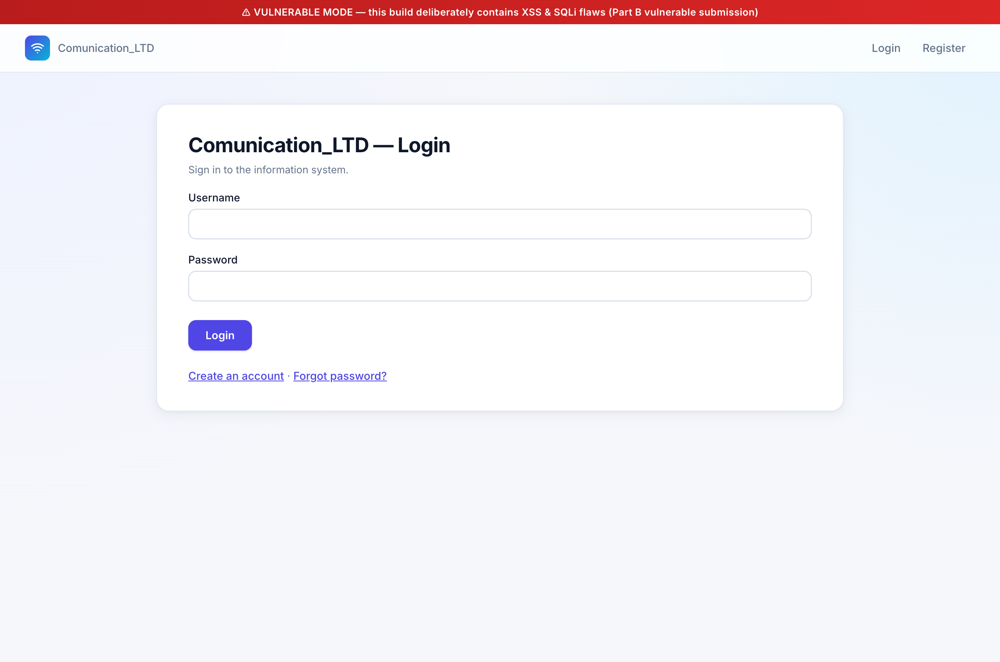
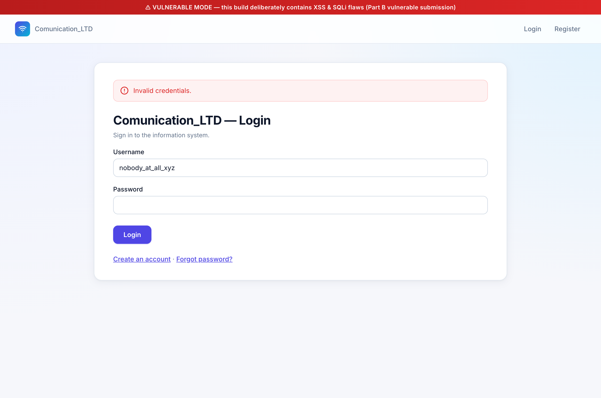
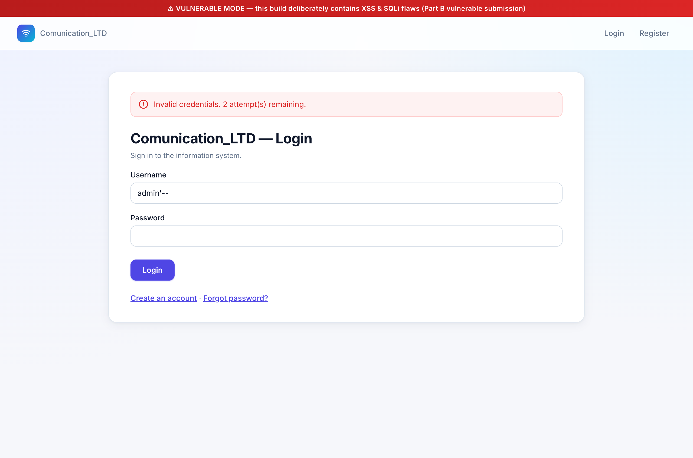
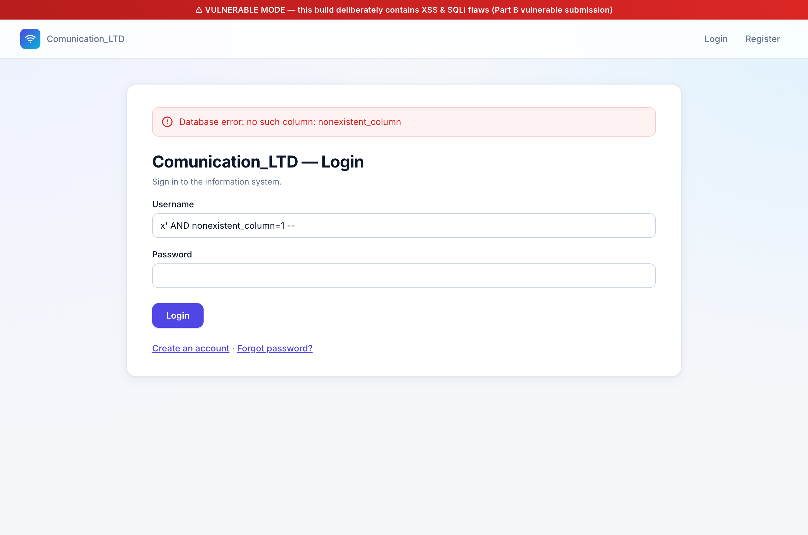

# SQL Injection — Part A, Section 3 (מסך Login)

Live demonstration of a **SQL Injection** vulnerability in the Login screen
of `Communication_LTD`, captured end-to-end via Chrome DevTools against the
running app in vulnerable mode (`VULNERABLE_MODE=1`).

This document covers the **attack** half of the requirement. The mitigation
(parameterized queries) is treated separately.

---

## 1. What the spec asks for

Part A, section 3 (מסך Login):

> הזנת יוזר — הזנת סיסמא — בדיקה אם המשתמש קיים או לא והחזרת הודעה מתאימה.

The Part B counterpart:

> הצגת דוגמא לשימוש בהתקפה מסוג SQLi על סעיף 3 מחלק א של הפרויקט.

---

## 2. The vulnerability

The user-lookup in [`login_view`](../../accounts/views.py) is built by string
concatenation when `VULNERABLE_MODE` is on. The username from the form is
spliced into the SQL text without escaping or binding.

[`accounts/views.py:119-134`](../../accounts/views.py#L119-L134):

```python
if settings.VULNERABLE_MODE:
    with connection.cursor() as cursor:
        sql = (
            "SELECT id, username, password_salt, password_hmac, "
            "failed_login_attempts, locked_until, is_active "
            f"FROM accounts_user WHERE username = '{username}'"
        )
        cursor.execute(sql)
        row = cursor.fetchone()
```

**Key oracle for the demo.** After `fetchone()`, the view's two error
branches produce *different* messages depending on whether a row came back
([accounts/views.py:166-184](../../accounts/views.py#L166-L184)):

| Outcome | Message shown to the user |
|---|---|
| Row found, wrong password | `Invalid credentials. N attempt(s) remaining.` (with counter) |
| Row not found | `Invalid credentials.` (no counter) |

So the **presence or absence of the counter** in the response is a side
channel that tells the attacker whether their payload made `fetchone()`
match a real row. That's enough to mount user enumeration without ever
needing valid credentials.

A small but important note up front: even when SQLi forces `fetchone()` to
return a row, the password is still verified by `verify_password()` using
HMAC+Salt ([accounts/utils.py:43-46](../../accounts/utils.py#L43-L46)). So
the attacker isn't *logged in* by this — but they have nonetheless leaked
information that should have been confidential, and as we'll see, they've
acquired a powerful griefing primitive too.

---

## 3. The attacks

### Step 0 — empty login screen (baseline UI)



Red banner confirms `VULNERABLE_MODE=1`. Section-3's Login form: username
and password, no surprises.

### Step 1 — establish the "unknown user" signal

Submit a username that obviously does not exist (`nobody_at_all_xyz`) with
any wrong password.



Message reads exactly `"Invalid credentials."` — no counter, no count of
attempts remaining. This is the response for *user not found*. Hold this
in mind as the reference point.

### Step 2 — comment-injection attack: `admin'--`

Before submitting, reset the admin row's counter to zero so we can observe
the side-effect cleanly:

```bash
$ sqlite3 db.sqlite3 \
    "UPDATE accounts_user SET failed_login_attempts=0, locked_until=NULL
       WHERE username='admin';"
$ sqlite3 db.sqlite3 \
    "SELECT username, failed_login_attempts FROM accounts_user WHERE username='admin';"
admin|0
```

Now submit the SQLi payload:

```
username = admin'--
password = wrong
```

The reconstructed SQL the server runs:

```sql
SELECT id, username, password_salt, password_hmac,
       failed_login_attempts, locked_until, is_active
  FROM accounts_user
 WHERE username = 'admin'--'
```

The `--` is SQL's single-line comment marker. SQLite drops everything from
`--` to end-of-line, which discards the trailing `'`. The effective query
is `... WHERE username = 'admin'` — and the admin row is returned.



Message now reads `"Invalid credentials. 2 attempt(s) remaining."` — the
counter is visible, so the SQLi succeeded. To make the side-effect
explicit, query the DB again:

```bash
$ sqlite3 db.sqlite3 \
    "SELECT username, failed_login_attempts FROM accounts_user WHERE username='admin';"
admin|1
```

The admin row's `failed_login_attempts` moved from **0 to 1** because of a
payload that *never typed the literal string `admin` into the username
field outside of a SQL fragment*. The application code believed it was
looking up a user named `admin'--`; the database actually returned admin.

Consequences:

- **User enumeration.** The attacker now knows `admin` exists. They can
  iterate the user table by guessing one name at a time, looking only at
  the response shape (counter / no counter).
- **Account griefing / DoS.** Three failed attempts triggers a 15-minute
  lockout. An attacker who knows valid usernames can lock legitimate users
  out of the system — even without credentials. The lockout policy was
  designed to thwart brute-force; the SQLi turns it into a weapon against
  the defender.
- **Schema leakage.** A `UNION SELECT`-style payload could project arbitrary
  columns through the seven-column query shape (`id, username,
  password_salt, password_hmac, failed_login_attempts, locked_until,
  is_active`), pulling salt/HMAC pairs out and into offline brute-force
  reach.

### Step 3 — smoking-gun: a SQLite parser error reaches the UI

The clearest possible proof that user input is treated as SQL syntax
(rather than as a bound value) is making the database itself complain
about syntactically-invalid SQL.

```
username = x' AND nonexistent_column=1 --
password = wrong
```

Reconstructed SQL:

```sql
... WHERE username = 'x' AND nonexistent_column=1 --'
```

`nonexistent_column` is, well, nonexistent. SQLite refuses to plan the
query:



The page renders the literal text **`Database error: no such column:
nonexistent_column`**. The only way for that string to reach the UI is for
SQLite's parser to have seen `nonexistent_column` as a column *identifier*
— which only happens if the attacker's input was concatenated into the SQL
text. A bound parameter would have been delivered as a value byte-string,
syntactically inert.

---

## 4. Honest caveats

These belong in the write-up so the grader sees you've considered them:

1. **No direct auth bypass.** HMAC+Salt verification still runs after the
   SQLi-returned row, so `admin'--` does not log the attacker in as admin.
   The damage is information disclosure (enumeration, salt/hmac leakage
   via UNION) plus account griefing (driving arbitrary users into
   lockout), not "instant admin".

2. **The lockout counter is the side channel.** A more security-aware
   build would deliberately collapse "user not found" and "wrong password"
   into the same message — that's the standard anti-enumeration defense.
   This build leaks because the counter only renders when a row was found.
   The SQLi gives the attacker a way to *amplify* the leak by forcing
   row-found regardless of whether the typed username actually exists.

3. **`DEBUG=True` exposes raw DB errors.** The smoking-gun screenshot
   shows the literal SQLite error message because `DEBUG=True` in
   `settings.py`. A production deployment with `DEBUG=False` would mask
   the error to a generic 500 page — but the SQLi *itself* still happens;
   it just becomes harder for the attacker to *learn* about. Information
   masking is not the same as fixing the bug.

---

## 5. Reproduction checklist

```bash
# 1. Start the vulnerable build
set -a; source .env; set +a
USE_SQLITE=1 VULNERABLE_MODE=1 python manage.py runserver

# 2. Reset admin's counter for a clean demo
sqlite3 db.sqlite3 "UPDATE accounts_user SET failed_login_attempts=0,
                                            locked_until=NULL
                    WHERE username='admin';"

# 3. http://127.0.0.1:8000/accounts/login/
#    a. username=nobody_at_all_xyz  password=wrong → "Invalid credentials."  (no counter)
#    b. username=admin'--           password=wrong → "Invalid credentials. N attempt(s) remaining."
#    c. username=x' AND nonexistent_column=1 --   → "Database error: no such column: nonexistent_column"

# 4. Confirm side-effect
sqlite3 db.sqlite3 "SELECT username, failed_login_attempts
                    FROM accounts_user WHERE username='admin';"
# → admin|1
```

---

## 6. Files referenced

| Path | Role |
|---|---|
| [`accounts/views.py:119-134`](../../accounts/views.py#L119-L134) | `login_view` — vulnerable user lookup |
| [`accounts/views.py:160`](../../accounts/views.py#L160) | HMAC verification — runs after the SQLi-returned row |
| [`accounts/views.py:166-184`](../../accounts/views.py#L166-L184) | The error-message branches that form the enumeration oracle |
| [`accounts/utils.py:43-46`](../../accounts/utils.py#L43-L46) | `verify_password` — constant-time HMAC compare |
| [`accounts/templates/accounts/login.html`](../../accounts/templates/accounts/login.html) | Login form |

| Screenshot | What it shows |
|---|---|
| [`screenshots/sqli-s3-01-login-empty.png`](screenshots/sqli-s3-01-login-empty.png) | Empty login form, vulnerable banner |
| [`screenshots/sqli-s3-02-baseline-unknown-user.png`](screenshots/sqli-s3-02-baseline-unknown-user.png) | Unknown user → "Invalid credentials." (no counter — the negative-class signal) |
| [`screenshots/sqli-s3-03-admin-comment-injection.png`](screenshots/sqli-s3-03-admin-comment-injection.png) | `admin'--` payload → "Invalid credentials. 2 attempt(s) remaining." (counter visible → admin row was found) |
| [`screenshots/sqli-s3-04-db-error-smoking-gun.png`](screenshots/sqli-s3-04-db-error-smoking-gun.png) | `x' AND nonexistent_column=1 --` → literal SQLite parser error in the UI |
