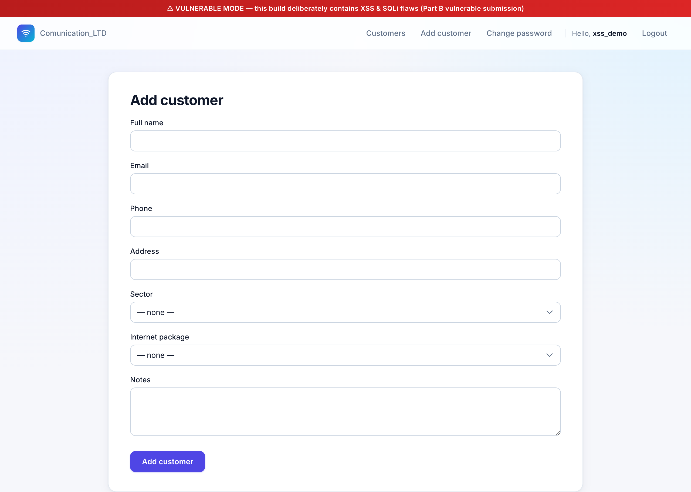
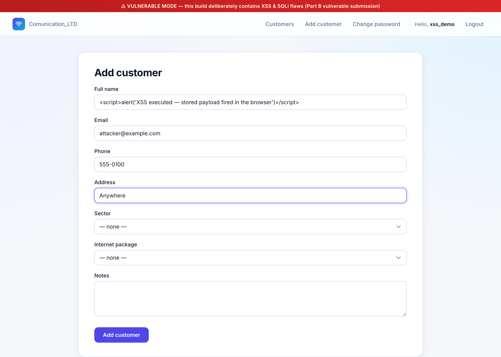
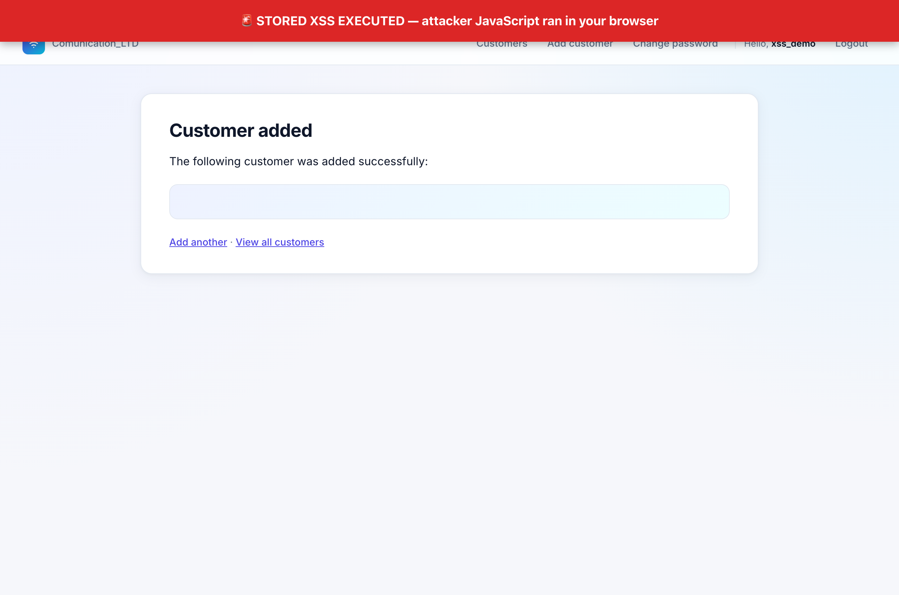
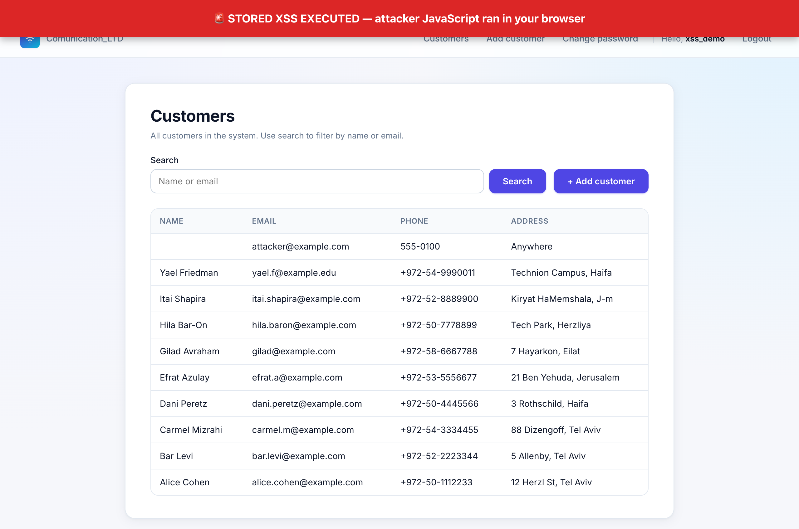
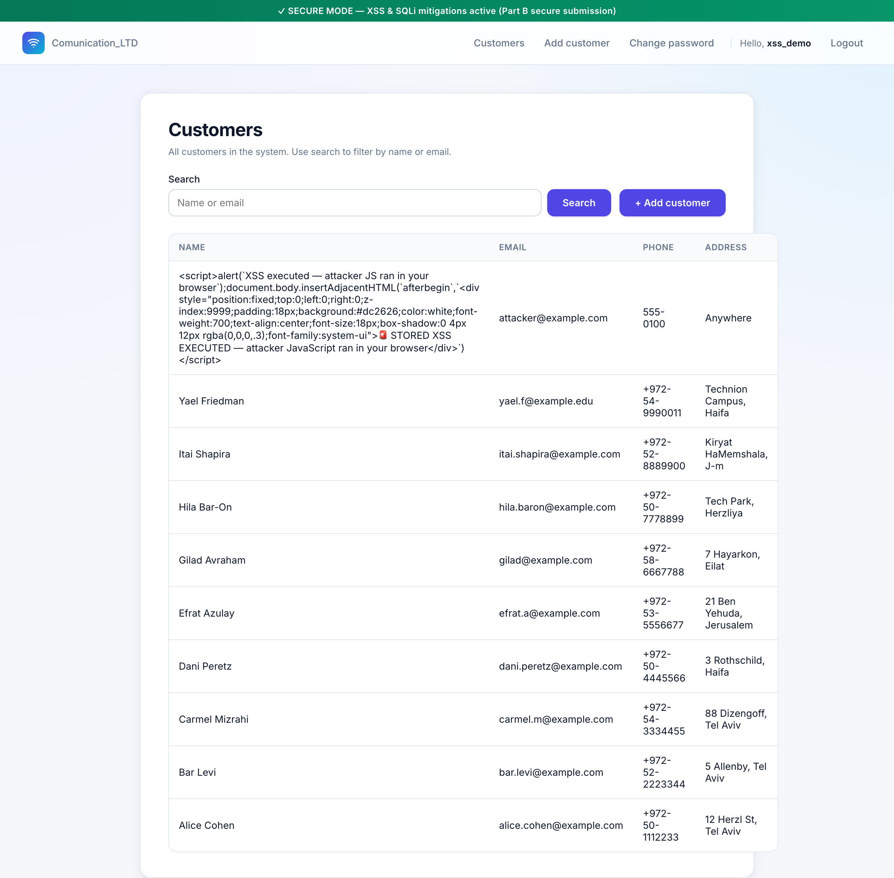
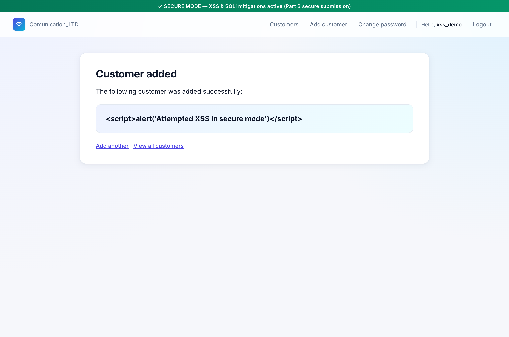

# Stored XSS — Part A, Section 4 (מסך מערכת)

Live demonstration of a **Stored Cross-Site Scripting** vulnerability in the
Customer-add screen of `Communication_LTD`, captured end-to-end via Chrome
DevTools against the running app.

The screenshots below are real captures of the running app, taken
in vulnerable mode (`VULNERABLE_MODE=1`) and then re-taken in secure mode
(`VULNERABLE_MODE=0`) against the **same persisted row** to prove the
mitigation works.

---

## 1. What the spec asks for

Part A, section 4 (מסך מערכת):

> הכנסת לקוח חדש עם פרטים חדשים. הצגה למסך את שם לקוח החדש שהוזן.

— Add a new customer, then display the entered name on screen.

Part B asks us to demonstrate Stored XSS against that screen and to apply
the **special-character encoding** mitigation:

> פתרון נגד הפרצות בסעיף 1 על ידי שימוש בקידוד של תווים מיוחדים

---

## 2. The vulnerability

Two templates render the user-supplied customer name with Django's `|safe`
filter when `VULNERABLE_MODE` is on. `|safe` disables Django's default HTML
auto-escaping, so any HTML the attacker writes — including a `<script>` tag —
goes straight into the DOM verbatim.

**Sink #1 — success page** in [`customers/templates/customers/customer_added.html`](../../customers/templates/customers/customer_added.html):

```django

    <strong>{{ added_name|safe }}</strong>   {# ⚠ XSS sink #}

    <strong>{{ added_name }}</strong>        {# ✓ auto-escaped #}

```

**Sink #2 — list page** in [`customers/templates/customers/customer_list.html`](../../customers/templates/customers/customer_list.html):

```django

    <td>{{ c.full_name|safe }}</td>          {# ⚠ XSS sink — stored persistence #}

    <td>{{ c.full_name }}</td>               {# ✓ auto-escaped #}

```

Because the name is **persisted to the database** (via
[`add_customer` in customers/views.py](../../customers/views.py)) before being
rendered, the payload fires for *every* user who later visits either screen —
this is the *stored* part of Stored XSS, as opposed to reflected XSS.

---

## 3. The attack — vulnerable mode

### Step 1 — log in as a normal user

Registered a regular user `xss_demo` and logged in. The red banner at the top
of every page is part of the demo build and confirms `VULNERABLE_MODE=1` is
active.

### Step 2 — open the Add-Customer form



The "Full name" field is free-text, no client-side filter, no server-side
sanitization on store.

### Step 3 — paste the XSS payload as the customer name

Payload used (template literals chosen to avoid breaking the unrelated
SQL-string-concatenation sink — see *Incidental finding* below):

```html
<script>
  alert(`XSS executed — attacker JS ran in your browser`);
  document.body.insertAdjacentHTML(`afterbegin`, `
    <div style="position:fixed;top:0;left:0;right:0;z-index:9999;
                padding:18px;background:#dc2626;color:white;
                font-weight:700;text-align:center;font-size:18px">
      🚨 STORED XSS EXECUTED — attacker JavaScript ran in your browser
    </div>
  `);
</script>
```

The `alert()` is the canonical proof-of-concept. The DOM-injection banner is
**additional** evidence — alerts get auto-dismissed in screenshots, so the
banner stays as visible proof that the script ran.



### Step 4 — submit → alert fires

The instant the **Customer added** page renders, the embedded `<script>`
executes. Chrome DevTools captured the dialog directly:

> **alert: `XSS executed — attacker JS ran in your browser`**

This is reported by the DevTools `handle_dialog` API — concrete evidence the
attacker's JavaScript took control of the page in the victim's session.

### Step 5 — confirm script execution via DOM mutation

After dismissing the dialog, the page is in the state shown below. The red
banner at the very top is the `<div>` that the malicious script inserted via
`document.body.insertAdjacentHTML(...)`. This banner only exists because the
attacker's JavaScript ran:



Notice the page itself contains only the legitimate UI ("Customer added", "The
following customer was added successfully:") — nothing in the application's
own HTML produces a red emergency banner. That banner is *exclusively*
attacker-controlled DOM.

### Step 6 — stored persistence

Navigating to **/customers/** (the list page) re-fires the alert *and* re-injects
the banner, because `customer_list.html` renders the same persisted value with
`|safe`:



This is the dangerous property of **stored** XSS: every user who lands on this
page — including admins, support staff, and other customers if they had
access — will execute the attacker's JavaScript with their own session
credentials. In a real attack the payload would silently exfiltrate cookies,
session tokens, or CSRF tokens to an attacker-controlled domain; the
`alert()` here is just a benign substitute.

---

## 4. The mitigation — secure mode

Restart with `VULNERABLE_MODE=0` (the secure submission) and reload the **same
list** without changing the database. The malicious row is still in the table,
but the rendered HTML changes.

### Step 1 — same persisted row, secure mode



The `<script>` tag now shows up as plain text in the Name column — no alert,
no injected banner, the navbar didn't reload anything malicious. Django's
default HTML auto-escaping converted the dangerous characters into HTML
entities. The actual HTML sent to the browser for that table cell is:

```html
<td>&lt;script&gt;alert(&#x27;Attempted XSS in secure mode&#x27;)&lt;/script&gt;</td>
```

(captured directly from `curl http://127.0.0.1:8000/customers/` in secure mode)

The browser sees `&lt;script&gt;` as the **characters** `<`, `s`, `c`, …
arranged as text content — *not* as the start of a `<script>` element. No
script element gets parsed, so no JavaScript runs.

### Step 2 — submit a fresh payload, customer-added view

Submitting `<script>alert('Attempted XSS in secure mode')</script>` through
the same form in secure mode reaches the success page **with no dialog and
no DOM injection** — the customer name displays as inert characters:



### What changed in the code

Only one filter was removed in each template:

```diff
- <strong>{{ added_name|safe }}</strong>
+ <strong>{{ added_name }}</strong>
```

```diff
- <td>{{ c.full_name|safe }}</td>
+ <td>{{ c.full_name }}</td>
```

This is the literal implementation of the spec's mandated mitigation:
**"שימוש בקידוד של תווים מיוחדים"** — encoding special characters
(`<` → `&lt;`, `>` → `&gt;`, `'` → `&#x27;`, `"` → `&quot;`, `&` → `&amp;`).
Django's template engine does this automatically; we just stop suppressing it.

---

## 5. Why "special-character encoding" works

The attack relies on the browser **parsing** the attacker's input as HTML
syntax. The four characters that turn arbitrary text into HTML constructs are:

| Character | Without encoding it can introduce… |
|-----------|-----------------------------------|
| `<`       | `<script>`, ``, any element |
| `>`       | closes a tag the attacker opened |
| `"` / `'` | breaks out of an attribute value to inject `onload=…` etc. |
| `&`       | crafts numeric character references that evade naïve filters |

Replacing each with its HTML entity (`&lt;`, `&gt;`, `&quot;`, `&#x27;`,
`&amp;`) preserves the **visual** content (the user still sees a `<` on
screen) while removing its **structural** meaning. The browser's HTML
parser never enters the "tag open" state, so the attacker's script element
is never constructed.

This is preferable to allow-/blocklist filtering because:

- it cannot be bypassed with case mismatches, null bytes, or exotic encodings;
- it works uniformly for all five sensitive characters;
- it preserves the original data — you can still display `O'Brien` correctly,
  whereas a "strip all quotes" filter would mangle it.

---

## 6. Incidental finding — secondary SQLi on the same screen

While running the attack, the first payload (using `'XSS'` with single quotes
as written in the README) produced an unexpected SQL error in vulnerable mode:

```
Database error: near "XSS": syntax error
```

The reason is that [`add_customer` in customers/views.py](../../customers/views.py)
also concatenates user input into a raw `INSERT` statement when
`VULNERABLE_MODE` is on — so a single quote inside the payload terminates the
SQL string literal early and breaks the parser. This is a **second**,
**distinct** vulnerability (SQL injection on the customer-add path,
documented separately as Part B section 4 — SQLi). The XSS payload had to be
rewritten to use **template literals (backticks)** to dodge the SQL sink and
reach the storage layer cleanly.

The interaction is worth flagging: the two vulnerabilities live on the same
form, but exploiting one requires careful payload design to avoid tripping
the other. The secure build fixes **both** independently — ORM-bound `INSERT`
removes the SQLi, dropping `|safe` removes the XSS.

---

## 7. Reproduction checklist

To re-run this demo locally:

```bash
# 1. Start the vulnerable build
set -a; source .env; set +a   # only needed if using real Gmail SMTP
USE_SQLITE=1 VULNERABLE_MODE=1 python manage.py runserver

# 2. In a browser at http://127.0.0.1:8000/
#    a. Register a user (any policy-compliant password)
#    b. Login
#    c. Customers → Add customer
#    d. Full name:  <script>alert(`XSS`)</script>
#       Email:      any
#    e. Submit → alert fires immediately
#    f. Navigate to /customers/ → alert fires again (stored persistence)

# 3. Switch to the secure build (same DB row stays)
USE_SQLITE=1 VULNERABLE_MODE=0 python manage.py runserver
#    g. /customers/ → row now shows literal "<script>alert(`XSS`)</script>"
#       as inert text. No dialog. No DOM mutation.
```

---

## 8. Files referenced

| Path | Role |
|---|---|
| [`customers/views.py`](../../customers/views.py) | `add_customer` view — receives the malicious name, persists it (raw SQL in vulnerable mode, ORM in secure mode) |
| [`customers/templates/customers/customer_added.html`](../../customers/templates/customers/customer_added.html) | XSS sink #1 — success page |
| [`customers/templates/customers/customer_list.html`](../../customers/templates/customers/customer_list.html) | XSS sink #2 — list page (stored persistence visible here) |
| [`communication_ltd/settings.py`](../../communication_ltd/settings.py) | `VULNERABLE_MODE` toggle that selects the vulnerable vs. mitigated code paths |
| [`templates/base.html`](../../templates/base.html) | Renders the red/green mode banner so each screenshot is unambiguous |

| Screenshot | Capture |
|---|---|
| [`screenshots/01-add-customer-form-empty.png`](screenshots/01-add-customer-form-empty.png) | Empty add-customer form, vulnerable mode |
| [`screenshots/02-add-customer-form-filled-payload.png`](screenshots/02-add-customer-form-filled-payload.png) | Form filled with the XSS payload |
| [`screenshots/04-customer-added-xss-fired.png`](screenshots/04-customer-added-xss-fired.png) | Success page showing the attacker-injected red banner — script executed |
| [`screenshots/05-customer-list-stored-persistence.png`](screenshots/05-customer-list-stored-persistence.png) | Customer list — script re-fires for every visitor |
| [`screenshots/06-customer-list-secure-mode.png`](screenshots/06-customer-list-secure-mode.png) | Same persisted row in secure mode — payload rendered as text |
| [`screenshots/07-customer-added-secure-mode.png`](screenshots/07-customer-added-secure-mode.png) | New submission in secure mode — auto-escape blocks execution |
